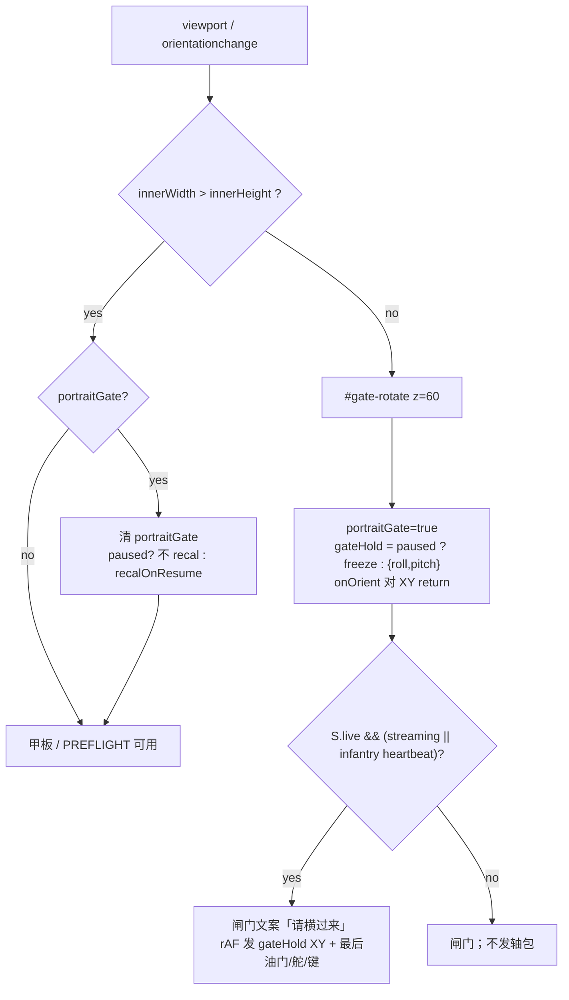
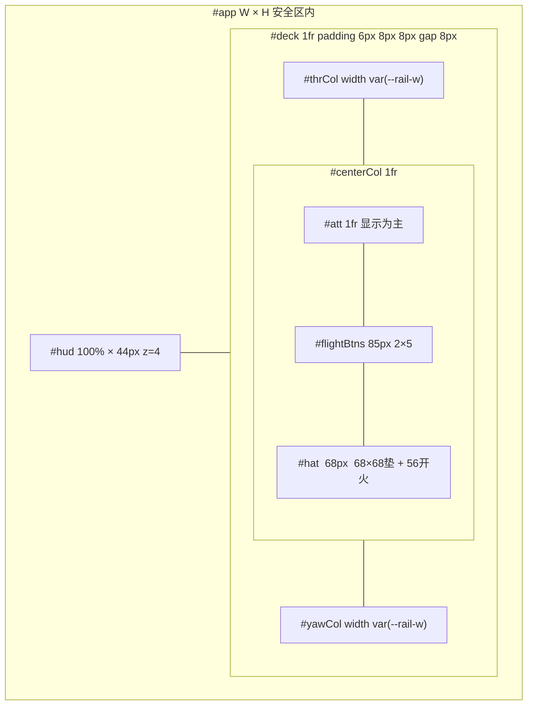
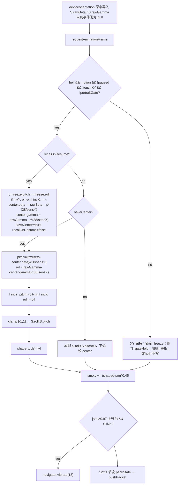
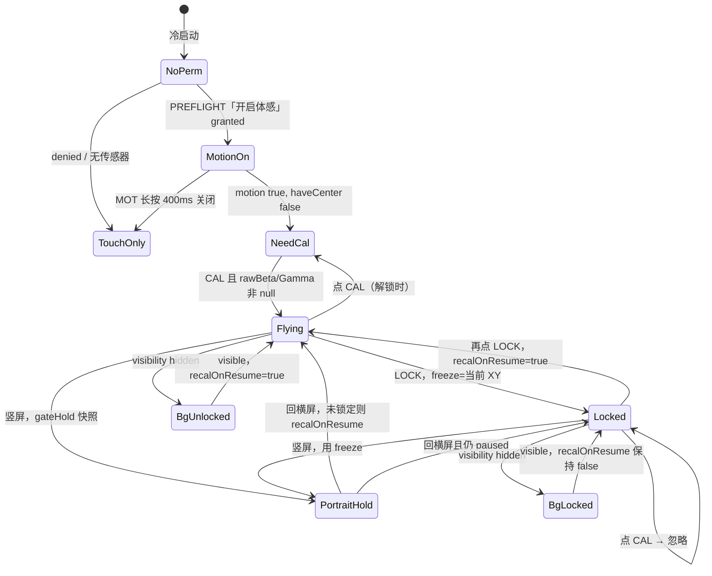
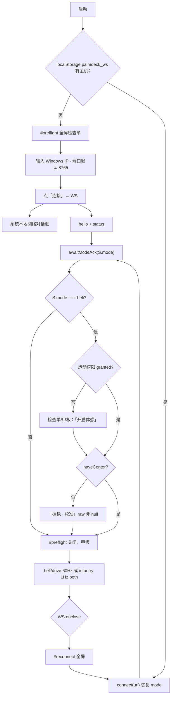

# PalmDeck 座舱：完整虚拟飞行控制器

| 字段 | 值 |
|---|---|
| 文档 | PalmDeck Phone App — Complete Virtual Flight Controller |
| 作者 | TBD |
| 日期 | 2026-09-22 |
| 状态 | Draft |
| 代码根 | `/Users/hui/Downloads/PalmDeck` |
| 座舱 | `web/index.html`（Capacitor iOS `com.palmdeck.yoke` 同源） |
| 电脑协议 | `docs/PalmDeck-v3-feature-design.md`（**本文不重开 HID / PD v1**） |
| 产品形态 | 一部横屏 iPhone = 一根完整飞行杆，不是「先做五个控件再改布局」 |

本文冻结**手机座舱**的物理隐喻、握持、像素级布局、体感管道、滑条手感、状态机、视觉系统和三种模式皮肤。电脑端 `bridge.py` / `hotas.py` / 22 字节 `PD` v1 / `awaitModeAck` / failsafe 以 v3 为准。座舱实现必须遵守那些合同；若 UX 不需要新字段，**禁止**改包。

工程 PR 只是同一设计的施工顺序，不是一串会改握持或改命中框的 MVP。

---

## Overview

PalmDeck 要把 iPhone 做成模拟飞行玩家愿意丢掉廉价 USB 杆的那根杆：双手横握，**整机倾斜 = 周期变距 / 副翼升降舵**，左滑条 = 油门（保持、带止动），右滑条 = 方向舵，正中是姿态球 / 飞行指引，显示正在发往电脑的杆位；苦力帽、开火、10 个带标签按钮全部落在拇指可达区。连接 Windows 是起飞前检查单，不是埋在设置里的表单。画面是夜航仪表，不是网页后台。

开车、步兵必须留在产品里（PC 游戏线不可撤），但是**同一 App 的次级皮肤**：开车 = 横屏方向盘 + 油门；步兵 =「用电脑键鼠」的休息屏并停掉 60Hz 轴。飞机只有**一套**杆布局；以后若做机型涂装，只许改漆，不许改命中框。

---

## Background & Motivation

### 当前状态

`web/index.html` 已经能飞：体感、锁定保持 XY、校准、油门 / 舵滑条、10 键、帽、开火、`packState()`、`PalmDeckUdpPlugin`、`awaitModeAck`。v3 把电脑侧门控、failsafe、轴预设钉死了。

它看起来和用起来仍像**带按钮的网页**，不像杆：

| 痛点 | 代码位置 | 后果 |
|---|---|---|
| 顶栏 + 模式行占掉仪表区 | `#app` `grid-template-rows: auto auto 1fr`；`.modes` 独立一行 | 姿态球被挤矮；夜航时信息在「卡片」里 |
| 竖屏「凑合能用」 | `@media (orientation: portrait)` 把两根滑条叠到上面 | 握持隐喻崩掉；滑条命中框随方向改 |
| 锁定钮在姿态球正中 | `#btnPause` 54×54 盖在球心 | 挡住飞行指引；点球容易误锁 |
| 连接是底栏 sheet | `#sheet` `place-items:end` | 第一次启动像填表；断线只靠 toast / 小圆点 |
| 方向舵视觉从底部填 | `setVert` 对 signed yaw 仍 `fill.height = t*100%` | 中位看起来像 50% 油门，不是舵 |
| 悬停是滑条下方一颗键 | `#btnHover` | 吃掉轨道高度；止动不是杆上的刻度 |
| 圆角 18px、青霓虹光 | `.stick` / `.knob` `box-shadow: 0 0 16px` | 赛博装饰，不是 PFD |
| Info.plist 仍允许竖屏 | `UISupportedInterfaceOrientations` 含 `Portrait` | 原生 App 会被转到竖屏，走进「凑合」分支 |
| 体感开着时仍能摸姿态球 | `applyAtt` 只要 `!paused` | 够 10 键时误触会把杆打飞（`S.touchXY`） |

模拟飞行用户的标准是：戴着手套般的拇指覆盖屏幕下三分之一时，仍然知道杆在哪、油门在哪、有没有连上电脑。当前布局做不到。

### 为何一次定死

杆的命中框就是肌肉记忆。先做窄滑条再加宽、先把锁定放球心再挪到 HUD、先做竖屏再删，等于让用户学两次。本文给出**唯一**横屏构图。实现可以分 PR 合入，但合入的每一步都是这块仪表板的零件，不是另一款 App。

---

## Goals & Non-Goals

### Goals

- 横屏锁定的双手飞行杆，iPhone 机身即杆。
- 一套飞机布局：左油门、中姿态球、右舵、下沿帽 + 开火 + 10 键；HUD 一条。
- 体感管道、锁定、校准、权限、前后台，状态穷举。
- 油门保持 + 止动（怠速 / 悬停 0.42 / 最大）；舵默认保持，可选回中弹簧。
- 连接 = 全屏起飞检查单；失败 = 全屏重连，不用 toast 当主通道。
- 夜航可读的设计系统（CSS tokens 替换现有 `:root`）。
- 开车、步兵作为完整皮肤写清，避免以后重做。
- 热路径仍是 `packState()` → UDP `PalmDeckUdp` 或二进制 WS；遵守 v3 `awaitModeAck`。

### Non-Goals

- 不是 MFi Game Controller，不是 USB HID gadget，不是 Lightning / USB-C 有线杆。
- 不是三种机型（直升机 / 固飞 / 空客）三套布局。飞机 **只有一套杆**。机型皮肤若做，只改漆（色、刻度文字），不改 `#flightBtns` / `#hat` / `--rail-w` / 滑条轨道。
- 不重开 v3：不改 `PKT`、不改默认 `hotas`（Z=throttle, Rz=yaw）、不开火映射（仍是包内 `rt>0.5` → vJoy 16）。
- 不把步兵做成手机键鼠，不抢 WASD。
- 不引入 React/Vue；座舱保持单文件 `web/index.html`（与现状一致）。
- 不做广告、IAP、账号、云同步、RGB 灯效。
- Android 可共用 `web/`，但本设计的发布门禁是 iOS + Safari 加到主屏幕。
- 不为 iPad 单独做分栏。iPad 跑同一套 clamp。

---

## Key Decisions

1. **机身即杆，屏幕上的球是指引不是杆。** 倾斜产生 `S.roll` / `S.pitch`。姿态球只显示已经 EMA 过、即将打包的 `S.sm`。体感开启且未锁定时球 `pointer-events: none`，避免够键误触。体感未开时球才降级为备用二维杆。  
   *理由：* 用户明确「手机本体是杆」；今日 `applyAtt` 与体感抢同一对 XY。

2. **只做横屏。竖屏不是布局，是闸门。** 原生 `Info.plist` 只保留 `LandscapeLeft` / `LandscapeRight`。Safari 竖屏全屏「请横过来」，**不**重排滑条。飞行中误竖屏：`S.portraitGate=true`，**按 LOCK 同款冻结 XY**（快照后忽略 `deviceorientation`），rAF 继续发 freeze + 最后油门/舵/键；回到横屏走 invert-aware `recalOnResume`（若当时未锁定）。禁止闸门下仍把 portrait 的 `beta`/`gamma` 写入杆。  
   *理由：* 用户禁止「凑合能用」的竖屏；Safari 不认 plist，闸门才是真产品路径。

3. **一条 HUD + 三列甲板，命中框用 clamp 钉死。** 顶栏 **44px**（HUD 内按钮 44×44）；左右轨 `--rail-w: clamp(72px, 15vw, 96px)`；10 键区 **85px**；帽行 **68px** = 一颗 **68×68 方向帽垫**（四向命中测试，不是五颗独立键）+ 旁边 **56×56 开火**。以后涂装不得改这些数。  
   *理由：* 肌肉记忆；68px 装不下 3×44 的 D-pad（见 Alternative F）。下三分之一给拇指，上半给眼睛。

4. **锁定在 HUD，不在球心。** 锁定保持当前 XY，不回零；解锁走 v3 invert-aware `recalOnResume`。锁定中校准被忽略。后台且锁定 **不** 设 `recalOnResume`。  
   *理由：* 与 v3 / FBW 合同一致，只改按钮位置。

5. **校准是每次冷启动的起飞动作，不持久化 `center`。** 连上之后、进入甲板前（或甲板上的球内大钮），用户点一次「校准」。XY 在 `haveCenter===false` 时强制按 0 打包。  
   *理由：* 握持每次不同；持久化中心会在下次打开时打满舵。

6. **连接是全屏 PREFLIGHT，不是 `#sheet`。** 第一次：IP → 本地网络 → 体感权限 →（仅 `heli`）校准 → 飞。再次打开：恢复 `palmdeck_ws` 与 `palmdeck_cfg.mode`，自动连。**校准门闩只对飞机**：开车 / 步兵进甲板不要求 `haveCenter`。无 Hub 不得进入甲板（本产品是杆，不是可关掉 sheet 的演示页）。断线：全屏 `#reconnect`。  
   *理由：* 用户禁止把连接埋进设置。开车轮是弹簧触摸，校准/体感对它无意义。

7. **油门保持 + 松手止动吸附；拖动过程不磁吸。** 止动：怠速 0.00、悬停 0.42、最大 1.00。窗口 ±0.025 仅在 `pointerup` 吸附。拖动只发穿越触觉，不跳变。  
   *理由：* 「实际好用」= 能在悬停附近微调；磁吸会抢杆。

8. **方向舵默认保持（非弹簧）。** 设置项 `yawSpring` 默认 `false`。中位是轨道上的刻度 + 可选双击回中，不是松手强制 0。  
   *理由：* 与今日 `attachThr(..., "yaw", true)` 一致；弹簧是口味，给开关。

9. **开车 / 步兵是皮肤，不是另一套 App。** HUD、`--rail-w`、token、连接流共用。开车隐藏舵列和 10 键 / 帽，左列换成方向盘（弹簧 XY，**同一 `shape`/EMA 0.45 / dz 0.06 / expo 1.35**）。步兵停 60Hz，10 键格子**仍占飞机同一 85px 框**作 vJoy 快捷键。开车 `#thrCol` 多一行 56px 刹车，油门轨仍是同一 DOM。  
   *理由：* 用户禁止删 PC 游戏线，也禁止以后再设计一遍。方向盘死区/指数与飞机共用，避免两套手感。

10. **PD v1 零增量。** 止动、弹簧、校准、皮肤全是本地。不新增包字段、不 bump `ver`。开火仍 `#heliFire` → `S.rt` → 包 `rt`。`hold()` **删除** JSON `{"type":"btn"}` / `{"type":"axes"}` 分支；未进 `bN`/hat 的名字直接忽略。  
    *理由：* 用户禁止重开 HID；v3 已规定 Hub 翻译。新座舱热路径不得依赖 JSON。

11. **切模式要按住 400ms。** 飞机 ↔ 开车 ↔ 步兵会 park HID。单击点不到。到达 400ms 时短振并切换，走 v3 `awaitModeAck`（**含步兵分支：`streaming` 保持 false，不 `openUdp()`**）。`awaitModeAck` 进行中忽略第二次按住。pointercancel 或位移 &gt;12px 取消计时。  
    *理由：* 拇指覆盖下三分之一时，误触「步兵」等于直升机杆消失。

12. **吸引来自状态，禁止装饰。** 动的、亮的、振的，必须对应轴 / 键 / 连接。禁止弹性缓动、赛博霓虹、粒子、广告。姿态球每帧跟 `S.sm`，油门带像总距表。  
    *理由：* 「非常吸引人且实际好用」= 仪表在说话，不是皮肤在闪。

13. **继续单文件座舱。** 逻辑留在 `web/index.html` IIFE。可抽纯函数 `shape` / `packState` 便于单测，但不引入打包器。  
    *理由：* 现状可维护；Capacitor `webDir` 已是 `../web`。

14. **竖屏闸门 = LOCK 式冻结，不是「继续跑 onOrient」。** 进入 `#gate-rotate` 时快照 `S.gateHold={roll,pitch}`（若当时已 `paused` 则用 `S.freeze`），`S.portraitGate=true`，体感管道对 XY return。rAF 仍发该 XY + 最后油门/舵/键。回横屏：清 `portraitGate`；未锁定且 `motion && haveCenter` 则 `recalOnResume=true`（与左右横屏翻转同一条路）。  
    *理由：* portrait 下 `beta`/`gamma` 会跳轴，把「最后一帧」覆盖成打满舵，比 failsafe 更糟。

15. **步兵 `awaitModeAck` 不得开流、不得 `openUdp`。** helper 结尾按 v3 原文：`if (name !== "infantry") { openUdp(); S.streaming = true }`，否则 `streaming` 保持 false。1Hz heartbeat 是 `if (mode==="infantry" && S.live) send(true)`，**不**看 `S.streaming`。步兵 ×3 park、1Hz、键边沿走 `pushPacket(buf, {both:true})`。  
    *理由：* 今日 `web/index.html` 的 helper 在 `finish()` 里无条件 `streaming=true` 再 `.then(openUdp)`，会重演 WASD 抢占。本文是座舱合同，不把这件事推给「与 v3 PR4 对齐」。

16. **关掉 MOT 必须长按 400ms（或设置里的开关），禁止单击关掉。** 单击 MOT：若未开则 `enableMotion()`（iOS 手势）；若已开则无操作（可闪「长按关闭」）。关掉后 `S.motion=false`、`haveCenter=false`、XY 打 0，姿态球才恢复触摸。  
    *理由：* KD1 规定关体感会重新打开球触摸；单击关 MOT 等于飞行中把杆交给误触。

17. **HUD 窄屏截断顺序钉死。** `connMeta` **永不**显示 `status.device`（那串 `vJoy Device #1 + Xbox 360` 只出现在 PREFLIGHT 成功行 / `#reconnect` / 设置只读行）。HUD 连接区 = 圆点 + `{hz}Hz` + `UDP|WS`（步兵改为 `KB`，不上色成红 1Hz）。`W < 700`：藏品牌。`W < 600`：藏 HUD 的 CAL（球上校准仍在）。模式三段永不删。  
    *理由：* SE 3 667 宽装不下「唯一一行」的全称设备名；截断必须写进构图，否则实现者会换行破坏 44px HUD。

---

## Proposed Design

### 1. 物理隐喻与握持

#### 隐喻

iPhone **就是**杆身。不是屏幕上画一根杆再去摸。

- 校准瞬间的握持 = 杆中位（`center.beta/gamma`）。
- 从该姿态把**屏幕左短边**压低 = 左滚，`S.roll < 0` → vJoy X 负。
- 把**屏幕上沿**（远离 Home 指示条的那条长边）拉近自己 = 拉杆抬头，`S.pitch > 0`；vJoy Y 在 `hotas.py` `remap_vjoy` 里已经是 `-pitch`（抬头为正语义，轴向下为负）。
- 推上沿远离自己 = 低头。
- 公式在**设备坐标系**用相对 `beta` / `gamma`，不把屏幕方向乘进旋转矩阵。左右横屏切换用校准 / `recalOnResume` 接上，不在 `onOrient` 里对调轴。

手感反了只许用设置 `invX` / `invY`，不许改默认公式（与今日 `web/index.html` `onOrient` 一致）。

#### 握持（双手横屏）

```
        上沿（远离身体，食指可搁，无控件）
   ┌─────────────────────────────────────┐
   │ HUD 32px（眼睛扫，不是飞行中主触区） │
   │  ██油门██    姿态球（看）    ██舵██  │
左 │  拇指滑      10 键 / 帽     拇指滑   │ 右
手 │  左轨        （拇指内收）    右轨    │ 手
   │         Home 指示条在屏幕下沿        │
   └─────────────────────────────────────┘
        下沿朝自己
```

| 部位 | 职责 |
|---|---|
| 左手掌 | 握住左短边（刘海 / 岛在左侧时避开，轨道已 inset） |
| 左拇指 | 油门轨道，可沿全高滑动；内收点左半 10 键 |
| 右手掌 | 握住右短边 |
| 右拇指 | 舵轨道，或内收点帽 / 开火 / 右半 10 键 |
| 双食指 | 搁上沿，不点键 |
| 双眼 | HUD + 姿态球。下三分之一允许被拇指挡住 |

参考机：iPhone 14 横屏 CSS **844×390**，安全区大约左 47 / 右 47 / 下 21。设计以 **安全区内矩形** 为 100%，不是整屏。

#### 安全区

```css
#app {
  padding: env(safe-area-inset-top) env(safe-area-inset-right)
           env(safe-area-inset-bottom) env(safe-area-inset-left);
}
```

- 刘海 / Dynamic Island 在横屏是左或右短边：`--rail-w` 已经在安全区**之内**，轨道不得再画进刘海。
- Home 指示条：底 padding 之后，帽行下沿再留 4px，禁止把开火放进指示条热区。
- 状态栏横屏多为 0；HUD 仍吃 `safe-area-inset-top`。

禁止：把 `padding` 只写在 `body` 却让 `#preflight` 用 `inset:0` 顶到刘海文字底下。所有全屏层同样吃安全区（内层 card 再 pad 16px）。

#### 左右横屏翻转

`screen.orientation.type` 在 `landscape-primary` ↔ `landscape-secondary` 之间变时：

| 当时状态 | 行为 |
|---|---|
| 锁定 | 保持 `S.freeze`，**不**设 `recalOnResume` |
| 未锁定且体感开 | 把当前 `S.roll/S.pitch` 快照为 freeze，设 `recalOnResume=true`（与解锁同一套 invert-aware 公式）。杆位连续，不回零 |
| 尚未校准 | 仍 `haveCenter=false`，XY 继续打 0 |
| 从竖屏闸门回到横屏 | 清 `portraitGate`。若 `paused`：`recalOnResume=false`，继续 `S.freeze`。若未锁定且 `motion && haveCenter`：`recalOnResume=true`。与上表「未锁定且体感开」同一公式 |

不在 `orientationchange` 上自动把杆打成 0（v3 已禁）。

#### 竖屏（不允许「凑合」）

Safari 不认 plist 横屏锁，**闸门是真产品路径**，不是皮带。



进入闸门必须**先快照再忽略 orientation**。禁止「继续跑 `onOrient` 但声称发最后一帧」——portrait 的 `beta`/`gamma` 会立刻覆盖 XY。

- `#gate-rotate`：黑底，中心一个横屏手机图标 +「横过来才能飞」。无按钮、无滑条、无输入框。PREFLIGHT 若当时开着，闸门盖在它上面（z=60）；回横屏后 PREFLIGHT 仍在。
- **删除**今日 `@media (orientation: portrait) { #page-heli { grid-template-columns:1fr 1fr; ... } }`。
- 原生：`mobile/ios/App/App/Info.plist` 与 `mobile/ios-Info.plist.additions` 的 `UISupportedInterfaceOrientations` **只**留：

```
UIInterfaceOrientationLandscapeLeft
UIInterfaceOrientationLandscapeRight
```

删掉 `UIInterfaceOrientationPortrait`（含 `~ipad`）。iPad 条目同样只留两个 Landscape。

- Capacitor：`mobile/capacitor.config.json` 与 `mobile/ios/App/App/capacitor.config.json` 的 `ios.contentInset` 从 `"automatic"` 改为 **`"never"`**。安全区只由 `#app` 的 `env(safe-area-inset-*)` 吃一次，禁止 WKWebView 再垫一层导致轨道被双重 inset。
- `web/manifest.webmanifest` 已是 `"orientation": "landscape"`，保持。
- PREFLIGHT 的 IP 输入也只在横屏。检查单 `overflow:auto`；IP 行 `position: sticky; top: 0`，横屏键盘弹出时仍能看见输入框。不为打字单独开竖屏。

#### 目标机与最小高度（clamp 实算）

冻结支出：`attH = H - 44 (HUD) - 14 (deck pad 6+8) - 85 (键) - 68 (帽) - 12 (中列两道 gap) = H - 223`。

| 机型 | 横屏 CSS | 安全区后 `W×H` | `attH` | 球 `D=0.88×attH` | 中列宽（轨 96、gap 8、deck 水平 pad 16） |
|---|---|---|---|---|---|
| iPhone SE 3 | 667×375 | 667×375 | **152px** | 134px | 667−16−192−16=443 |
| iPhone 14 | 844×390 | 750×369（L/R 47，底 21） | **146px** | 128px | 750−16−192−16=526 |
| iPhone 15 Pro Max | 932×430 | ~814×409（L/R ~59，底 21） | **186px** | 164px | ~814−224=590 |

`#app` 高度 **&lt; 320px**（几乎不会）：HUD 仍 44px，10 键仍 40px 行高，姿态球吃剩余。禁止把按钮缩到 40px 以下。禁止为了球变大而改 85/68。

---

### 2. 全屏布局（唯一构图）

只此一张飞机甲板。单位：`#app` 安全区内宽 `W`、高 `H`。



#### 网格（替换今日 `#app` / `#page-heli`）

```css
#app {
  height: 100%;
  display: grid;
  grid-template-rows: var(--hud-h) 1fr;
  min-height: 0;
}
#deck {
  display: grid;
  grid-template-columns: var(--rail-w) 1fr var(--rail-w);
  gap: var(--gap);
  min-height: 0;
  padding: 6px 8px 8px;
}
#centerCol {
  display: grid;
  grid-template-rows: minmax(0, 1fr) 85px 68px;
  gap: 6px;
  min-height: 0;
}
```

`--hud-h: 44px;` `--gap: 8px;` `--rail-w: clamp(72px, 15vw, 96px);`

iPhone 14 安全区约 750×369 时：轨 96px，中列约 526px，10 键每格宽 ≈ 101px，高 40px。`attH = 146px`（见上表）。

#### 区域表

| id | 分数 / 尺寸 | 触摸 | 显示 | z |
|---|---|---|---|---|
| `#hud` | `W × 44px` | 仅其内按钮（**44×44**） | 品牌（可藏）、圆点+Hz+传输、MOT、LOCK、CAL、模式、齿轮 | 4 |
| `#thrCol` | `--rail-w × (H-44)` | **是** 轨 + 右缘 40px 止动芯片 | 油门带、芯片、数字 | 1 |
| `#yawCol` | 同上 | **是** 轨 + 中位 40px 芯片 | 舵、芯片、数字 | 1 |
| `#att` | 中列剩余高度（`H-223`） | 仅当 `!S.motion` | 姿态球、指引、磁带 | 1 |
| `#flightBtns` | 中列 × **85px**（2×40 + 5 gap） | **是** | 10 个标签 | 2 |
| `#hat` | 中列 × **68px** | **是** | 68×68 帽垫 + 56×56 开火 | 2 |
| `#preflight` | 全屏 | 是 | 起飞检查单 | 50 |
| `#reconnect` | 全屏 | 是 | 断线 | 50 |
| `#settings` | 全屏遮罩 + 右/中面板 | 是 | 手感 / 标签 | 40 |
| `#gate-rotate` | 全屏 | 否 | 竖屏闸门 | 60 |

删除：独立 `.modes` 行、`#btnPause` 在球心、`#btnHover` 独立键、底栏 `#sheet` 作为主连接 UI、`.toast` 作为断线主通道。

#### HUD 内容（从左到右，单行，禁止换行）

```
[PALMDECK] [● 62Hz UDP]   [MOT] [LOCK] [CAL]   [飞机] [开车] [步兵]  [⚙]
```

截断（KD17）：`W<700` 去掉 `PALMDECK`；`W<600` 去掉 HUD `CAL`。`connMeta` 永不含设备全名。

SE 3 667 预算：品牌约 80 + 圆点 Hz 传输约 90 + 7×44 按钮 = 80+90+308 = 478 &lt; 667。全称 `vJoy Device #1 + Xbox 360 · 62Hz UDP` **不准**进这一行。

| 控件 | 尺寸 | 行为 | heli | drive | infantry |
|---|---|---|---|---|---|
| 品牌 | 11px，字距 0.12em | 长按 600ms 打开设置 | 显示 | 显示 | 显示 |
| `#connMeta` | 11px 等宽 | **圆点 + `{hz}Hz` + `UDP\|WS`**。未连：琥珀 +「未连」。步兵：圆点 + `KB`（`--pfd-cyan`），**不**画红 `1Hz`。已连点击无效；未连打开 `#reconnect` | Hz 着色 | Hz 着色 | `KB` |
| `#btnMotion` | **44×44**，`MOT` | 见 §5 / KD16。drive/infantry：**禁用**（opacity 0.35，点击 no-op） | 活 | 禁用 | 禁用 |
| `#btnLock` | **44×44**，`LOCK` | 见 §5。未开体感时点它 = 先 `enableMotion()`。非 heli：禁用 | 活 | 禁用 | 禁用 |
| `#btnCal` | **44×44**，`CAL` | 预飞校准。锁定中忽略。非 heli：禁用 | 活 | 禁用 | 禁用 |
| 模式三段 | 各 **44×44** | **按住 400ms**；进度环。`awaitModeAck` 未完成前忽略第二次按住。pointercancel 或位移 &gt;12px 取消。`data-mode` = `heli`/`drive`/`infantry` | 活 | 活 | 活 |
| `#btnSettings` | **44×44** 齿轮 | 手感与按钮标签，**不含 IP** | 活 | 活 | 活 |

Hz 着色（仅 `S.streaming===true` 的 heli/drive）：≥55 绿，20–55 琥珀，&lt;20 红。未连 `--text-dim`。

#### 左列油门 `#thrCol`

```
.skin-heli / .skin-infantry:  grid-template-rows: 16px 1fr;
.skin-drive:                  grid-template-rows: 16px 1fr 56px;
轨行内部: grid-template-columns: minmax(0,1fr) 40px;
```

```
  油门                 ← 11px 标签，高 16px
  [  轨   ][MAX 40]    ← 芯片列 40px，不启动拖动
  [  轨   ][HVR 40]
  [  轨   ][IDL 40]
  42                   ← handle 上 12px tabular
  [刹车 56]            ← 仅 skin-drive
```

- 轨列：左 inset 4px；handle 高 **44px**。`--rail-w` 最小 72 = 轨 ~28 + 芯片 40 + 缝 4。
- 三颗芯片各 **40×40**，垂直对齐止动位置（MAX 贴顶、HVR 在轨道高度的 42%、IDL 贴底）。`pointerdown` 在芯片上：**立即**写入该止动，**不** `setPointerCapture` 到轨道，不开始拖动。
- 轨道 `pointerdown` 才是拖动。松手 ±0.025 吸附仍只作用于拖动结束。
- 填充从底部向上，高度 = `throttle * 100%`。
- `#handbrake` 仅 `skin-drive` 显示，高 56px，`data-btn="b2"` + `S.lt=1`。heli/infantry：`display:none`。
- **同一 DOM**：`#thrCol` / `#colTrack` / `#colFill` / `#colH` 不因皮肤复制。禁止再引入 `#drvThr`。

#### 右列舵 `#yawCol`

```
  舵                   ← 16px 标签行
  [  轨   ][   ]
  [  轨   ][CTR 40]    ← 中位芯片 40×40，立即 yaw=0
  [  轨   ]
```

- 语义仍 `yaw ∈ [-1,1]`，视觉 `t = (yaw+1)/2` 只用于 handle 位置，**填充不得**再用 `fill.height=t*100%`。
- 实现：两条 fill（`.fill-pos` 从 50% 向上，`.fill-neg` 从 50% 向下），或一条 `scaleY` 以中位为 transform-origin。
- 点 `CTR` 芯片：立即 0，清 `sm.yaw`。芯片不开始拖动。
- 双击轨道回中：两次 `pointerup` 间隔 ≤300ms，且两次按下期间位移都 **≤10px**。慢拖不是双击。

#### 中列姿态球 `#att`

显示已发送杆位，不是世界地平仪（没有用 `alpha` 做航向）。视觉借用 PFD：球随 `S.sm.roll/pitch` 动，飞机符号固定。

- 球直径 `D = min(centerColW, attH) * 0.88`，居中。
- 天 `#1e4a72` → `#0e2438`，地 `#4a321c` → `#24180e`，地平线 `--horizon` 2px。
- 滚转：球 `rotate(sm.roll * 90deg)`（满轴 = 90° 可视，不是 38° 物理角）。
- 俯仰：地平线 `translateY(-sm.pitch * D * 0.42)`。满俯仰不得把天或地移出球。
- 固定层：黄色飞机 W 符 48×16px、十字虚线、±0.5 / ±1.0 刻度。
- 飞行指引：14×14 空心圆环 + 十字，位置与今日 `setKnob` 相同：

```
left = (sm.roll  * 0.5 + 0.5) * 100%
top  = (0.5 - sm.pitch * 0.5) * 100%
```

今日 `.knob` 56px 实心圆 **删除**（盖住仪表）。

- 未校准：球上大字「校准」，点它 = `btnCal`。
- 锁定：球 55% 亮度 + 琥珀旗 `HOLD`（替代球心按钮）。
- 磁带：左下 `R -0.12` 右下 `P +0.04`，11px 等宽，两位小数。

#### 10 键 `#flightBtns`

```
b1 刹车 | b2 视角 | b3 自动驾驶 | b4 反推 | b5 减速板收
b6 减速板放 | b7 襟翼收 | b8 襟翼放 | b9 停机刹车 | b10 起落架
```

与今日 `DEFAULT_LABELS` / `data-btn="b1"…"b10"` 一致。HID 仍是 mask bit0–bit9 = vJoy 1–10。改名不改 HID。

格子：`repeat(5, 1fr) / repeat(2, 1fr)`，高 40px，字 10px / 600，允许两行省略号。按下 class `hold`。

#### 帽 + 开火 `#hat`（真帽垫，不是五键）

68px 行装不下 3×44 的 D-pad（44+间隙+44+间隙+44 ≥ 140）。冻结交互为 **一颗垫 + 一颗开火**：

```
#hat { height:68px; display:flex; align-items:center; justify-content:center; gap:8px; }
#hatPad   68×68
#heliFire 56×56
```

```
  ┌────────┐  ┌──────┐
  │  帽垫  │  │ 开火 │
  │ 68×68  │  │ 56×56│
  └────────┘  └──────┘
```

`#hatPad` 命中（指针相对垫中心 `x,y`，单位 CSS px）：

| 条件 | `S.hat` | `look_x, look_y` |
|---|---|---|
| `hypot(x,y) < 12` 或 pointerup | 255 | 0, 0 |
| `|y| ≥ |x|` 且 `y < 0` | 0 up | 0, +1 |
| `|x| > |y|` 且 `x > 0` | 1 right | +1, 0 |
| `|y| ≥ |x|` 且 `y > 0` | 2 down | 0, −1 |
| `|x| > |y|` 且 `x < 0` | 3 left | −1, 0 |

同一时刻一个方向。视觉：四瓣 + 中心窝，按下瓣 `--pfd-green`。无独立 ▲◀▶▼ DOM 按钮（可保留内部 `hold("hat_up")` 调用，不暴露五键布局）。

- `#heliFire` 仍 `bindTrig(..., "rt")`，**不是** 10 键之一。
- 协议仍 `hat` 0/1/2/3/255 + `look_*`（v3：POV 与 Rx/Ry 同时写是有意的）。

#### 拇指覆盖下三分之一时仍可用

iPhone 14 高 390，下三分之一 = 130px。从底往上：Home 21 + deck 底 pad 8 + 帽 68 = 97px，再吃掉 10 键区约 33px。被挡的是帽/开火和 10 键下沿（本来就要摸）。**不被挡**：HUD、姿态球（`attH` 146px 在上半）、油门/舵上段。Hz、连接、锁定、杆位全在上半。禁止把 Hz 或连接状态放到球下方。

---

### 3. 体感管道

只在 `S.mode==="heli"` 且 `S.motion` 且权限 `granted`。开车 / 步兵的 `onOrient` 直接 return（与今日一致）。



`G` **不含** `haveCenter`：未校准走 MATH 旁路的 `ZERO`，不是死代码。`portraitGate` 在 `G` 上挡掉，闸门期间 HOLD 用 `gateHold`。

相对今日的**故意变化**：`haveCenter===false` 时 **不再** 在 `onOrient` 第一帧偷偷 `center=当前`。校准必须是一次明确动作，在此之前打包 XY = 0。否则冷启动前 200ms 会把杆甩到随机角。`S.rawBeta` / `S.rawGamma` 初始为 `null`。

#### 常量（钉死，与 v3 同值除非上表写明）

| 参数 | 值 | 位置 |
|---|---|---|
| 满轴倾角 | `38° / sens` | 相对 `center` |
| `sensX` / `sensY` | 默认 `1.0`，范围 `0.4–2.2` step `0.05` | 独立 |
| 死区 `dz` | 默认 `0.06`，范围 `0–0.20` | `shape()` |
| expo | `1.35` | `shape()` |
| XY EMA | `0.45` | `send()` |
| yaw EMA | `0.50`，死区 `0.08` | `send()` |
| look 死区 | `0.05`，**无 EMA** | `packState` |
| 传感器 | 只 `beta` / `gamma`。不用 `alpha`、不用加速度计当杆 | `onOrient` |
| 采样 | 监听器原率写入 raw（iOS 约 60Hz），**不**在监听器里 pack | |
| 发送 | rAF + `now - S.last < 12` → 上限 ≈83Hz，目标 **60Hz** | 与今日 `send()` |
| 限位振动 | `\|sm.roll\|>0.97` 或 `\|sm.pitch\|>0.97`，上升沿 18ms，仅 `S.live` | `buzz()` |
| 触摸覆盖 | 仅 `!S.motion`（权限拒绝 / 未开）时姿态球可当二维杆；松手回 0 | 见 Key Decision 1 |
| 锁定中触摸球 | 忽略（v3 A15） | |
| 竖屏闸门 | `portraitGate`：忽略 orientation，发 `gateHold` | KD14 |

解锁公式必须先把 freeze **按 invert 还原**再算 `center`（今日 `web/index.html` 约 488–494 行）。禁止写成 `center.beta = beta - freeze.pitch * 38/sensY` 而不管 `invY`。

#### 开车误带体感

切到 `drive` / `infantry`：`onOrient` return，不把姿态写入摇杆。`S.motion` 标志可保持，切回 `heli` 时若未锁定则 `recalOnResume=true`（v3）。

---

### 4. 油门与方向舵手感

#### 共用滑条合同

- `setPointerCapture`。第一指拥有轨道，第二指忽略。
- `pointercancel`（系统手势）：**保持最后值**，不跳 0。油门 / 舵是保持轴，不是弹簧键。
- 切后台、断线：本地值不变。不把油门写入 `localStorage`（避免下次集体距在满，v3）。
- 发包走同一 rAF / 12ms。拖动不另外 debounce。

#### 油门（`S.throttle ∈ [0,1]`）

| 项 | 合同 |
|---|---|
| 默认 | `0.35`（与今日一致，低于悬停） |
| 松手 | **保持** |
| 止动 | `IDLE=0.00`，`HOVER=0.42`，`MAX=1.00` |
| 拖动 | 连续；穿越止动 `buzz(10)` 仅 `S.live`；**无**磁吸 |
| 松手吸附 | 若 `|v - detent| ≤ 0.025` 则写入该止动并 `buzz(12)` |
| 点芯片 | 右侧 40×40 芯片立即写入该止动，不开始拖动（HVR = 旧悬停键） |
| 开车 | 同一 `#colTrack` DOM、同一 `--rail-w`。`thrReturnDrive` 默认 `false`；若打开：未按住时每帧 `throttle += (0-throttle)*0.28`，当 `throttle < 0.01` 时 **snap 到 0**（否则 60Hz 下约 10% 残值，不是「到达」） |

禁止油门满行程连续振动（v3：直升机总距拉满会一直震）。

#### 方向舵（`S.yaw ∈ [-1,1]`）

| 项 | 合同 |
|---|---|
| 默认 | `0`，视觉中位 |
| `yawSpring` | 默认 **false**（保持）。true：未按住时每帧 `yaw += (0-yaw)*0.22`，当 `|yaw| < 0.01` 时 **snap 到 0** 并清 `sm.yaw` |
| 中位止动 | 松手时 `|yaw| ≤ 0.08` 则写 0 并 `buzz(8)`（弹簧模式下无意义，跳过） |
| 点中位芯片 / 合格双击 | 立即 0，清 `sm.yaw`。双击位移阈值 10px、窗口 300ms |
| 开车 | 本列不存在；切开车时 `yaw=0` 并发一帧，避免上一局舵量变成 Xbox 右摇杆（v3） |

#### 禁止意外跳变（清单）

1. 滑条 `pointerup` 不回 0（除非舵弹簧或开车回中油门打开）。
2. 锁定只冻 XY，不改油门 / 舵。
3. 校准不改油门 / 舵。
4. 切模式清零表见 §8（XY / yaw / hat / look / rt / lt 进入时清；油门本地保持；`btnMask` 仍按下的保持）。
5. `haveCenter=false` 只把 XY 打 0，油门仍是 0.35 或用户值。

---

### 5. 锁定 / 校准 / 权限 / 前后台

#### 状态

```
MotionPermission: unknown | prompt | granted | denied
S.motion:         false | true          // 用户已点 MOT 且 granted
S.haveCenter:     false | true          // 当次会话校准过
S.paused:         false | true          // LOCK
S.recalOnResume:  false | true
S.portraitGate:   false | true          // 竖屏闸门
S.gateHold:       {roll,pitch}          // 进闸门时快照
S.rawBeta/Gamma:  number | null
visibility:       visible | hidden
S.live:           WS OPEN 且已连
S.streaming:      v3 门闩（步兵 false）
S.modeSwitching:  false | true          // awaitModeAck 进行中
```



#### MOT（`#btnMotion` / PREFLIGHT 同一 `enableMotion()`）

iOS 必须用户手势调用 `DeviceOrientationEvent.requestPermission()`。PREFLIGHT 的「开启体感」就是这个手势。`granted` 之后：

```
window.removeEventListener("deviceorientation", onOrient);
window.addEventListener("deviceorientation", onOrient, true);
S.motion = true;
S.paused = false;
// 不在这里 haveCenter=true
```

| 结果 | HUD MOT | 行为 |
|---|---|---|
| 未要过 | 暗 | 单击 = `enableMotion()`。姿态球可触摸当备用杆 |
| granted 且 !paused | 绿 `MOT` | 球 `pointer-events:none`。**单击无操作**（可闪「长按关闭」）；**长按 400ms** 才关 |
| paused | 琥珀 `HOLD` | 球忽略触摸。关 MOT 仍要 400ms |
| denied | 暗，单击打开系统说明 | 「没有体感权限，请在系统设置里允许运动与健身」。备用杆仍可用 |
| 无传感器 | 同上 | 「这台设备不支持体感」 |
| 设置开关关掉 / 长按关 | 暗 | `S.motion=false`，`haveCenter=false`，XY=0，球恢复触摸 |
| drive / infantry | 暗、禁用 | no-op |

`NSMotionUsageDescription` 已在 `Info.plist`：「用于把 iPhone 倾斜映射成游戏摇杆。」不改。

#### LOCK（从球心挪到 HUD）

| 动作 | 行为 |
|---|---|
| 未开体感时点 LOCK | 先 `enableMotion()`，不进入锁定 |
| 进入 | `paused=true`，`freeze={roll,pitch}`，`onOrient` 对 XY return，rAF **继续发** freeze 后的 sm。球暗 + `HOLD`。油门 / 舵 / 键仍活 |
| 退出 | `paused=false`，`recalOnResume=true`，下一帧 invert-aware 重挂 `center`，俯仰连续 |
| 锁定中摸球 | 忽略 down/move/up（修今日 `endAtt` 把 freeze 打成 0） |
| 锁定中断线 | freeze 留在手机；重连后继续发同一 XY，不自动解锁 |
| 锁定中 `visibility=visible` | **不**设 `recalOnResume`（今日已有，保持） |

触觉：进入锁定 `buzz(10)` 仅 `S.live`。

#### CAL

- 未锁定且 `S.rawBeta` / `S.rawGamma` **都不是 `null`**：`haveCenter=false` 先把 XY/`sm.xy` 打 0 并 `send()`，随即 `center={beta:rawBeta, gamma:rawGamma}`，`haveCenter=true`。`buzz(24)` 仅 live。
- `rawBeta` 或 `rawGamma` 为 `null`（监听器尚未出帧）：**忽略这次点**，球上校准层保持，「等待传感器」。**禁止**写 `center={0,0}`。
- 锁定中：忽略。HUD 闪「先解锁再校准」（1.2s）。
- 不改油门、舵、按钮。
- `center` 不写 `localStorage`。
- 非 heli：HUD CAL 禁用；PREFLIGHT 不要求校准。

#### 前后台

| 事件 | 行为 |
|---|---|
| hidden | WKWebView 停 JS；电脑走 v3 `park_ms` failsafe。本地状态机保持 |
| visible | `wakeLock.request("screen")`；WS 非 OPEN 则 `connect`（onopen 仍 `awaitModeAck`）；锁定则 `recalOnResume=false`；未锁定且 motion 则 `recalOnResume=true` |
| iOS idle timer | 只在 `PalmDeckUdpPlugin.open/close` 里 `isIdleTimerDisabled`（v3）。不钩 `SceneDelegate` |
| 不声明 `audio` 后台模式 | 后台就是停包 |

---

### 6. 视觉设计系统

替换 `web/index.html` 现有 `:root` 与圆角 18px 卡片风。关键词：夜航 PFD，不是赛博表单。

```css
:root {
  --bg: #05070a;
  --bg-panel: #0b1018;
  --bg-inset: #070b10;
  --line: #1c2a3a;
  --line-hot: #3a5a78;
  --text: #d8e4f0;
  --text-dim: #7a8fa3;
  --sky: #1e4a72;
  --sky-deep: #0e2438;
  --ground: #4a321c;
  --ground-deep: #24180e;
  --horizon: #e8f0f4;
  --fd: #d4a017;
  --pfd-green: #33e07a;
  --pfd-cyan: #4ec8e0;
  --caution: #e0a020;
  --warn: #e04a3a;
  --fire: #c43c2e;
  --knob: #d8e4f0;
  --throttle-fill: var(--pfd-cyan);
  --yaw-fill: #b8862a;
  --hud-h: 44px;
  --rail-w: clamp(72px, 15vw, 96px);
  --gap: 8px;
  --radius-panel: 6px;
  --font-hud: "SF Mono", "Menlo", ui-monospace, monospace;
  --font-ui: "SF Pro Display", "PingFang SC", "Noto Sans SC", system-ui, sans-serif;
  --press-ms: 0ms;
}
```

| 角色 | Token | 用法 |
|---|---|---|
| 背景 | `--bg` | `html,body,#gate-rotate,#preflight` |
| 面板 | `--bg-panel` / `--line` | 轨、键、HUD 底。圆角 **6px**（仪器，不是 iOS 卡片） |
| 正常 | `--pfd-green` | 已连接点、Hz≥55、MOT on、键按下描边 |
| 青 | `--pfd-cyan` | 油门填充、UDP 标签 |
| 琥珀 | `--caution` | Hz 20–55、锁定 HOLD、重连中、未校准 |
| 红 | `--warn` / `--fire` | Hz&lt;20、断线、开火按下填充 |
| 指引 | `--fd` | 姿态球飞机符与 FD 环 |
| 字 | `--text` 11–12px HUD；按钮 10px | 对比 ≥ 7:1。禁止 100 weight |
| 等宽 | `--font-hud` + `tabular-nums` | Hz、油门百分数、R/P 磁带 |

**按下：** `background: #152032; border-color: var(--pfd-green); color: var(--pfd-green);` 过渡 `var(--press-ms)` = 0。禁止 `transform: scale`。

**主题色：** `meta theme-color` 与 manifest `background_color` 改为 `#05070a`。

**禁止清单（视觉）：** 霓虹外发光超过 8px；紫 / 粉 RGB；毛玻璃 `backdrop-filter` 模糊仪表；弹性 `cubic-bezier` 用在杆或滑条；emoji；营销插画；底部安全区广告条。

姿态球 CSS 结构（实现提示，非协议）：

```html
<div id="att" class="att">
  <div id="attBall" class="att-ball"></div>
  <div class="att-fixed"><!-- 十字、W 符、刻度 --></div>
  <div id="attK" class="fd-pip"></div>
  <div id="attFlag"></div>
</div>
```

`#attBall` 每帧只改 `transform`（rotate + translateY），不重绘 DOM 树。

---

### 7. 会话流



#### 第一次启动（无 `palmdeck_ws`）

`#preflight` 盖住甲板。夜航检查单，左对齐等宽字，不是底 sheet。

```css
#preflight { overflow: auto; -webkit-overflow-scrolling: touch; }
#preflight .ip-row { position: sticky; top: 0; background: var(--bg); z-index: 1; }
```

横屏键盘（SE 375 高）会盖住下半；IP 行必须 sticky 在可视顶，检查单可滚。

```
PREFLIGHT

 1. 电脑已打开 PalmDeck
 2. 手机与电脑同一 Wi-Fi
 3. 电脑 IP
    [ 192.168.3.103     ]  :8765
 4. [ 连接 ]
    · 本地网络权限
    · WebSocket 8765
 5. [ 开启体感 ]          ← 仅当将以 heli 进入时强调
 6. 双手横握，保持自然姿态
    [ 校准 ]              ← 仅 heli 强制
 7. [ 进入座舱 ]
```

步骤 7 启用条件：

| 将进入的 mode | 步骤 7 可点 |
|---|---|
| `heli` | `S.live && haveCenter` |
| `drive` / `infantry` | `S.live` 即可（不要求校准 / 体感） |

**无 Hub 不得进入甲板。** 这是故意的：本产品是杆，不是可关掉 sheet 的演示页。Capacitor 无 IP 则停在 PREFLIGHT。Safari 从电脑 HTTP 打开时 `location.hostname` 即 Hub。不提供 `?demo=1`。

- 端口默认 8765，输入框 64px 宽，不强调。完整 `ws://` 仍可粘贴进 IP 框（今日 `composeUrl` 语义保留）。
- Capacitor / `file:` / `localhost`：**禁止**把 `location.hostname` 当电脑 IP（今日 `defaultHost()` 已如此）。占位可空或 `192.168.3.103`。
- 从电脑 HTTP 打开的 Safari：`defaultHost()` 用 `location.hostname`（v3）。
- 步骤 4 成功：检查项打绿叉。设备全名（`status.device`）写在检查单成功行，不进 HUD。
- 步骤 5 调 `enableMotion()`。heli 下拒绝不阻塞进入（备用触摸杆），但步骤 7 仍要 `haveCenter`（无体感的校准把触摸中位设为球心：`haveCenter=true`，不写 `center={0,0}` 到 orientation）。
- 步骤 7 关掉 `#preflight`。

#### 再次打开

1. 读 `palmdeck_ws`、`palmdeck_cfg.mode`（`heli|drive|infantry`）。
2. 不打开 PREFLIGHT；HUD 琥珀「连接中…」。
3. `connect(url)` → `awaitModeAck(mode)`。
4. 若权限已 granted，自动 `enableMotion()`（不再弹 PREFLIGHT；iOS 已授权时 `requestPermission` 可在启动时调用，若系统仍要手势则 HUD MOT 琥珀闪，等一次点击）。
5. 若恢复 mode 为 **heli**：甲板可用，XY 打 0，球上「校准」直到点 CAL（油门 / 舵 / 键立即可用）。drive / infantry：**不**挡校准。
6. 失败：见下，不是小 toast。

#### 失败 / 重连 — `#reconnect` 全屏

替代今日 `onclose` toast「重连中…」和 `retry===2` 才弹出 sheet。

```
与电脑断开

正在重连  192.168.3.103:8765
backoff 文案：第 n 次 · 下一试 Xs

[ 更改地址 ]
IP 输入 + 连接   （同一 composeUrl）
```

- `S.live=false`，`udpReady=false`，停 haptic。
- backoff 保持今日 `600 + retry*400` ms，封顶 4s。
- 第 1 次失败就全屏，不等 `retry===2`。
- 重连成功：关层，toast 级确认可要可不要（≤1.2s「已连上」）；若锁定则继续 freeze。
- 改地址成功写入 `palmdeck_ws`。

`#settings` **删除 IP 字段**。改地址只在 PREFLIGHT / RECONNECT。面板字段如下（仪器风，非 iOS Settings 克隆）：

| 控件 | 默认 | 何时有效 |
|---|---|---|
| 横滚灵敏度 `sensX` | 1.0（0.4–2.2） | 飞机体感 |
| 俯仰灵敏度 `sensY` | 1.0 | 飞机体感 |
| 死区 `dz` | 0.06（0–0.20） | 飞机 + 开车轮（同一 `shape`） |
| 反转横滚 `invX` | false | 飞机 |
| 反转俯仰 `invY` | false | 飞机 |
| 方向舵弹簧 `yawSpring` | **false** | 仅飞机；开车列隐藏 |
| 开车松手油门回中 `thrReturnDrive` | **false** | 仅开车；飞机列隐藏 |
| 体感开关 | 跟随 `S.motion` | 关 = 与 MOT 长按相同 |
| 按钮名称 `labels[10]` | 今日 DEFAULT_LABELS | 只改字，不改 HID |
| 只读：电脑设备名 | `status.device` | 全名只在这里和 PREFLIGHT |

#### 持久化

| Key | 内容 |
|---|---|
| `palmdeck_ws` | `ws://ip:port` |
| `palmdeck_cfg` | `{sensX,sensY,dz,invX,invY,labels,mode,yawSpring,thrReturnDrive}` |

`yawSpring` 默认 `false`，`thrReturnDrive` 默认 `false`。不存油门、不存 `center`、不存 `paused`。

#### Wake / ping

保持：5s JSON `ping`；`visibilitychange` 重拿 wakeLock。与 v3 一致。

---

### 8. 开车与步兵（完整皮肤）

`#app` 加 class `skin-heli` | `skin-drive` | `skin-infantry`。HUD 网格永远在。切皮肤 **不得**改 `--hud-h`、`--rail-w`、`#flightBtns` 的 85px、`#hat` 的 68px（步兵仍用这两框）。

切模式：400ms 按住 → `S.modeSwitching=true` → `awaitModeAck(name)`（步兵分支见 §10）→ 按下表清轴 → `modeSwitching=false`。进行中忽略第二次按住。

#### 进入模式清零表

| 字段 | → heli | → drive | → infantry |
|---|---|---|---|
| `throttle` | **保持** | **保持** | 本地保持；**pack 0** |
| `yaw` / `sm.yaw` | **0** | **0** | **0** |
| `roll`/`pitch`/`sm.xy` | 0；若 motion 且未锁则 `recalOnResume` | **0**（轮回中） | **0** |
| `hat` | 255 | 255 | 255 |
| `look_x`/`look_y` | 0 | 0 | 0 |
| `rt` | 0 | n/a（pack 用 throttle） | 0 |
| `lt` | 0 | 0（除非刹车仍按住） | 0 |
| `btnMask` | **保持仍按下的键**（v3 A20） | 同左 | 同左 |
| `touchXY` | false | false | false |

禁止从步兵切回飞机时把上一局 `yaw` 带进 vJoy Rz。

#### 开车 `skin-drive`

```css
.skin-drive #deck { grid-template-columns: 1fr var(--rail-w); }
.skin-drive #yawCol,
.skin-drive #flightBtns,
.skin-drive #hat { display: none; }
.skin-drive #att { display: none; }
.skin-drive #wheel { display: block; }
.skin-drive #thrCol { grid-template-rows: 16px 1fr 56px; }
.skin-drive #handbrake { display: block; height: 56px; }
.skin-heli #handbrake, .skin-infantry #handbrake { display: none; }
```

`#thrCol` / `#colTrack` / `#colFill` / `#colH` **同一节点**，不建 `#drvThr`。CSS 把 `#thrCol` 放在右列（deck 第二列是 `1fr` 轮、第三列轨——实现：drive 时 `#yawCol` 隐藏，`#thrCol` 仍是 grid 第三列，轮占第一列 `1fr`，中间列变 0？更干净：

```css
.skin-drive #deck { grid-template-columns: 1fr var(--rail-w); }
.skin-drive #thrCol { grid-column: 2; }
.skin-drive #centerCol { grid-column: 1; } /* 只显示 #wheel */
```

| 控件 | 语义 | Xbox live | 备注 |
|---|---|---|---|
| `#wheel` 直径 `min(colW, colH)*0.82` | 弹簧 `roll/pitch`，松手立即 0 | LS | 视觉：轮旋转 `roll*90deg`；Y 用三角「前」 |
| 右轨油门 | `throttle`，pack `rt=throttle` | RT | 同一 `#colTrack`；`thrReturnDrive` 默认关 |
| `#handbrake` 56px | `data-btn="b2"` + `S.lt=1` | B+LT | 不发 JSON `btn` |
| MOT/LOCK/CAL | 禁用 | | HUD 表见 §2 |

方向盘滤波：**与飞机同一** `shape(v, dz=0.06)`、expo 1.35、EMA 0.45。松手 `S.roll=S.pitch=0`，sm 跟 EMA 收中（与今日 `attachStick` 一致）。不另开「开车线性」叉。

无姿态球、无舵、无 10 键、无帽。以后加 10 键必须另开设计。

#### 步兵 `skin-infantry`

休息屏。`awaitModeAck("infantry")` 返回后 **`S.streaming` 保持 false，不 `openUdp()`**。然后 `send(true)` park ×3（0 / 50 / 100ms），`pushPacket(..., {both:true})`。1Hz：`setInterval(() => { if (S.mode==="infantry" && S.live) send(true); }, 1000)` — **不**判断 `S.streaming`。`packState` 模拟量 0。

```
#thrCol / #yawCol：opacity 0.35；pointer-events:none
#att：球停平飞，中央大字
   KB / MOUSE
   电脑键鼠操作中 · 轴已停
#flightBtns：显示，同一 85px，vJoy 快捷；hold() 在 !streaming 时 send(true) + both
#hat：显示，同一 68px 帽垫+开火（开火 pack rt 但 Hub 步兵强制 0；帽写 POV）
HUD connMeta：`KB`，不是红 1Hz
```

Hub 步兵不写 Xbox（v3）。手机不得模拟 WASD。

离开步兵：同一 `awaitModeAck`；heli 若 motion 仍开则 `recalOnResume=true`。

---

### 9. 吸引来自状态，不是装饰

#### 必须动 / 亮 / 振

| 元素 | 为何存在 |
|---|---|
| 姿态球地平线每帧跟 `S.sm` | 不看磁带也知道杆在哪 |
| FD 环跟同一 `S.sm` | 飞行指引 |
| 油门填充高度 + handle 百分数 | 总距表 |
| 舵从中位双向填充 | 舵位置 |
| 止动刻度在穿越时亮 120ms | 确认过悬停 |
| 连接点 | `S.live`；可 1Hz 呼吸，幅度 ≤ 6px glow |
| Hz 数字 | **仅 `S.streaming`** 时用控制台阈值：≥55 绿，20–55 琥珀，&lt;20 红。步兵显示 `KB`（`--pfd-cyan`），不画 1Hz 红 |
| 键 / 帽 / 开火 `hold` | 按下态 = HID 按下 |
| 开火 | 按下 `--fire` 填充；`buzz(16)` 边沿，仅 live |
| 限位 / 止动 / 校准 / 锁定 haptic | 见下表 |

#### 触觉目录（全部 `if (!S.live) return`）

| 事件 | ms |
|---|---|
| XY 限位进入 | 18 |
| 油门穿越止动 | 10 |
| 油门松手吸附 | 12 |
| 舵中位吸附 | 8 |
| 校准成功 | 24 |
| 进入锁定 | 10 |
| 开火按下 | 16 |
| 切模式 400ms 达成 | 12 |
| 连接成功 | 20 |
| 断线 | **不振** |

无传感器马达：`vibrate` 失败忽略。

#### 禁止

- 赛博霓虹、扫描线、粒子、bloom 动画在杆中位空闲时仍跑
- 杆 / 滑条使用 bounce、overshoot、`transition: 300ms ease`
- 广告、IAP、评分弹窗
- emoji 当按钮
- 为「好看」在 60Hz 外再加一套缓动（唯一滤波是 EMA 0.45/0.50）

---

### 10. 映射到现有协议

**零增量字段。** 包仍是：

```
PKT = struct.Struct("<2sBB8hH")  # 22 bytes
# PD | ver=1 | hat | roll pitch yaw look_x look_y thr lt rt | buttons
```

座舱继续用现有 `packState()` 真值表（`tests/test_pack_state.py` 已锁）：

```
rt_out  = drive ? throttle : infantry ? 0 : S.rt
thr_out = infantry ? 0 : S.throttle
lt_out  = infantry ? 0 : (S.lt || S.brakes)
```

| 座舱控件 | 字段 | Hub / HID（v3，默认 `hotas`） |
|---|---|---|
| 体感 / 备用球 | `roll` `pitch` i16 | vJoy X / Y=`-pitch` |
| 右滑条 | `yaw` | vJoy Rz |
| 左滑条 | `thr` | vJoy Z=`throttle*2-1` |
| 帽 | `hat` 0..3/255 + `look_*` | POV + Rx/Ry |
| 开火 | `rt` 0\|1 | **vJoy button 16**（`rt>0.5`）；双设备不写 Xbox RT |
| 10 键 | `buttons` bit0–9 | vJoy 1–10 |
| 开车油门 | `rt=throttle` 且 `thr=throttle` | Xbox RT |
| 开车刹车 | bit1 + `lt=1` | Xbox B+LT |
| 步兵 | 全模拟量 0 | Hub `park_infantry_all_zero`；1Hz heartbeat skip HID |

`pushPacket(buf, opts)` 是**座舱合同**（今日实现缺 `both`，本设计必须补上）：

```
function pushPacket(buf, opts) {
  const both = opts && opts.both;
  // 60Hz 热路径：udpReady → 只 UDP；否则 WS binary
  // both:true（步兵 ×3 park、1Hz、步兵键/帽边沿）：UDP 与 WS binary 都发
}
```

`hold()`：只处理 `/^b(\d+)$/` 与 `hat_*`。匹配则更新 mask/hat，若 `!S.streaming` 则 `send(true)`（内部 `both:true`）。**删除** `ws.send(JSON.stringify({type:"btn",...}))` 与任何 JSON `axes`。未知名字忽略。

`awaitModeAck(name)` 按 v3 原文实现（今日 `web/index.html` `finish()` 无条件 `streaming=true` 再 `openUdp()` **是 bug，必须改**）：

```
S.streaming = false
ws.send({type:"mode", name})
st = first type:status after this send, or 1000ms timeout
if timeout:
  HUD「MODE TIMEOUT」1.2s
  goto stream
if !("cockpit_mode" in st):          // 旧 Hub：connect status 无此键
  goto stream                        // A26
wait until a status has cockpit_mode === name, remaining time of same 1s budget
if timeout: HUD 旗；goto stream
stream:
  if (name !== "infantry") { openUdp(); S.streaming = true }
  // infantry: streaming 保持 false；3× park 用 send(force=true, both)
```

禁止在 helper 返回前 `openUdp()`。`hello` 不参与新旧判定。每条 WS `onopen` 重置 `hubAcksMode`。

步兵 1Hz：**不**写 `if (S.streaming && ...)`。写 `if (S.mode === "infantry" && S.live) send(true)`。

`PalmDeckUdpPlugin`：`open({host,port})` / `send({data:base64})` / `close()`。座舱 UX 不新增插件方法。`packageClassList` **已经**含 `PalmDeckUdpPlugin`（`mobile/capacitor.config.json` 与 `ios/App/App/capacitor.config.json`）；本设计的 iOS 工作是方向 plist + `contentInset: "never"`，不是再打一遍插件注册。

#### 若将来要加包（本文不批准）

只有在「电脑必须知道校准/锁定」时才需要 flag。电脑 failsafe 不需要这些：锁定时手机继续发 freeze 轴。**本设计不加。**

---

## API / Interface Changes

座舱 DOM 替换（实现者按 id 接线，旧 id 删除）：

| 旧 | 新 |
|---|---|
| `.top` + `.modes` | `#hud` |
| `#btnPause` 在 `#att` 内 | `#btnLock` 在 HUD |
| `#btnHover` | `#thrCol` 内 40×40 芯片 `[data-detent="0.42"]` |
| `#btnYawCenter` | `#yawCol` 内 40×40 `CTR` 芯片 |
| `.hat button` 五键 | `#hatPad` 68×68 + `#heliFire` 56×56 |
| `#sheet` 主连接 | `#preflight` / `#reconnect` |
| `#page-heli` 三列 68px | `#deck` + `--rail-w` |
| portrait 媒体查询 | `#gate-rotate` |
| `.knob` 56px | `.fd-pip` 14px |

JS 状态新增（均可进 `S`）：`rawBeta`, `rawGamma`（`null` 初始）, `yawSpring`, `thrReturnDrive`, `perm`, `portraitGate`, `gateHold`, `modeSwitching`。`haveCenter` 语义收紧（见 §3）。`pushPacket` 增加 `{both}`。`awaitModeAck` 步兵不复位 `streaming`。

电脑 API 无变更。

原生：`Info.plist` / `ios-Info.plist.additions` 去掉 Portrait；两份 `capacitor.config.json` 的 `ios.contentInset` = `"never"`。插件注册已完成，不作为本设计阻断。

---

## Data Model Changes

无数据库。`localStorage` 见 §7。`center` / `throttle` / `paused` 不持久化。

---

## Alternatives Considered

### A. 屏幕上的虚拟摇杆当主杆，倾斜当辅

把姿态球做成永远可摸的 2D 杆，体感当叠加。

- 优点：无权限也能飞；和手柄习惯接近。
- 缺点：用户要求「机身即杆」；摸球与 10 键争拇指；今日误触已存在。
- **不采用为主路径。** 体感关时才降级为备用杆。

### B. 保留竖屏重排

- 优点：单手看设置、IP 输入键盘更高。
- 缺点：滑条命中框随方向变，违反「一次定死」；竖握倾斜轴与横握校准不兼容。
- **不采用。** 竖屏只有闸门。IP 在横屏输入。

### C. 油门弹簧 / 舵默认弹簧

- 优点：松手安全。
- 缺点：直升机总距松手掉集体距会坠机；v3 failsafe 都选择 hold throttle。
- **不采用为默认。** 开车油门回中、舵弹簧均为默认关的设置项。

### D. 连接放设置 sheet（现状）

- 优点：实现已在。
- 缺点：用户明确要起飞检查单；断线 toast 不够。
- **不采用。**

### E. 三种机型三套甲板

- 优点：看起来「完整模拟器」。
- 缺点：命中框分裂；用户禁止。涂装只改漆。
- **不采用。**

---

## Security & Privacy Considerations

沿用 v3。座舱侧补充：

| 威胁 | 严重度 | 缓解 |
|---|---|---|
| 运动数据 | 低 | 仅本机算姿态，不上传。权限文案已有 |
| 本地网络 | 低 | `NSLocalNetworkUsageDescription` 已有；PREFLIGHT 明确「同一 Wi-Fi」 |
| 明文 `ws://` | 低（LAN） | 已有 ATS 例外。不做 TLS |
| 误触切到步兵导致游戏内杆消失 | 中 | 模式 400ms 按住 |
| 锁屏后杆停在最后一帧 | 中 | 电脑 `park_ms`；座舱不在 hidden 时假发送 |

不收集遥测。不接第三方（控制台 QR 的 CDN 是 v3 控制台的事，座舱不画 QR）。

---

## Observability

| 信号 | 哪里 | 阈值 |
|---|---|---|
| Hz | HUD，来自 `status.hz` | ≥55 绿，20–55 琥珀，&lt;20 红 |
| 传输 | HUD `UDP` / `WS` | 来自 `status.transport`；无字段则有 `udpReady` 显示 UDP 否则 WS |
| 连接 | 绿 / 琥珀点 | `S.live` |
| 体感 | MOT 绿 / HOLD 琥珀 / 暗 | |
| 校准 | 球旗 / CAL 琥珀直到 `haveCenter` | |
| 模式 ack 超时 | HUD 琥珀 `MODE TIMEOUT` 1.2s | 替代今日 toast；仍开流（v3） |

不打每帧 `console.log`。`bridge.py` 日志仍是电脑的事。

---

## Rollout Plan

- **无双布局开关。** 不留「旧网页顶栏」flag。主干上的座舱 PR 按下面顺序堆同一块甲板。
- **发布门禁：** 本文件 PR1–PR5 全部合入后才把该 `web/` 打进 iOS / 给 Windows exe。禁止只合 PR1 就当产品发（用户会看见没有体感的空仪表）。
- **回滚：** 回上一份 `web/index.html` + `Info.plist`。HID 不受影响。
- **协议：** 可与 v3 Hub PR 并行；`awaitModeAck` 在旧 Hub 上必须仍能飞（A26）。
- Windows 主路径。Mac 只验证页面与 `backend=none`。

---

## Risks

| 风险 | 严重度 | 缓解 |
|---|---|---|
| 竖屏闸门在飞行中停包，电脑 failsafe 回中 XY | 高 | 已 streaming 的竖屏闸门**继续发最后一帧** |
| 体感开时禁触摸球，无权限用户不会飞 | 中 | 未开体感时球仍是备用杆；PREFLIGHT 写明 |
| `--rail-w` 96px 在 SE 吃掉中列 | 低 | SE 667 中列仍 &gt;440px，10 键可用 |
| 刘海吃掉左油门 | 高 | 轨道在安全区内；测 landscape-left 与 right |
| 校准前 XY=0 改变今日「第一帧当中心」 | 中 | 故意的；避免随机打满。PREFLIGHT 强制点一次 |
| 400ms 切模式被当成失灵 | 低 | 进度环 + 文案；到达才振 |
| 开车隐藏 10 键，以后有人后悔 | 低 | 本文冻结；要加另开设计 |
| iOS 仍允许 Portrait（漏改 plist） | 高 | PR5 清单；闸门仍兜底 |
| 姿态球 90° 可视滚转被当成真实地平 | 低 | 文档 / HUD 不写「地平仪」，写「杆位」 |
| rAF + 球 transform 掉帧 | 低 | 只改 transform；目标仍 60Hz |

---

## Open Questions

无。口味分叉已冻结为设置项默认值：

- `yawSpring = false`
- `thrReturnDrive = false`
- 开车不显示 10 键 / 帽
- 悬停止动 = 0.42（沿用今日）

工程不得把这些再当成未决题停工。

---

## References

- `docs/PalmDeck-v3-feature-design.md` — 协议、模式门控、failsafe、`awaitModeAck`
- `web/index.html` — 现座舱（将被本设计替换布局与视觉，保留 pack / ack / UDP）
- `bridge.py` — `PKT`，`Hub.set_cockpit_mode`，`hello.version: "3.0"`
- `hotas.py` — `remap_vjoy("hotas")`，开火 button 16
- `tests/test_pack_state.py` — pack 真值表
- `mobile/ios/App/App/PalmDeckUdpPlugin.swift` — UDP + idle timer
- `mobile/ios/App/App/Info.plist` — 方向、运动、本地网络
- `web/manifest.webmanifest` — `orientation: landscape`
- FBW 已验证：锁定保持、解锁重挂 Y、限位振动仅已连接、无热路径 JSON

---

## PR Plan

下列 PR 是**同一冻结设计**的施工顺序。每一个都实现本文的最终命中框 / 隐喻；禁止出现「v1 先竖屏」或「v1 先把锁定放球心」。未写的电脑协议工作仍走 v3 自己的 PR 表。

### PR1 — 座舱甲板壳：token、横屏网格、竖屏闸门、静态仪表

- **标题：** `feat(cockpit): night-flight deck layout and landscape gate`
- **文件：** `web/index.html`，`web/manifest.webmanifest`（theme-color `#05070a`）
- **依赖：** 无
- **内容：** 落地 `:root` tokens；`#app` / `#hud` / `#deck` / `#thrCol` / `#centerCol` / `#yawCol` / `#att` / `#flightBtns` / `#hat` 几何（85px / 68px / `--rail-w`）。删除 portrait 媒体查询与球心 `#btnPause`、独立 `.modes` 行、`#btnHover`、`#btnYawCenter`。舵填充改为中位双向。姿态球静态 PFD（可先用 CSS，transform 可暂接现有 `sm`）。`#gate-rotate` 竖屏闸门。10 键 / 帽 / 开火 id 与 `data-btn` / `data-hat` 保持，逻辑可暂接旧 JS。**不改** `packState` / UDP / `awaitModeAck`。看起来已经是最终甲板，即使体感仍是旧函数。

### PR2 — 体感管道、锁定 / 校准、止动、触觉

- **标题：** `feat(cockpit): motion pipeline, lock/cal, throttle detents, haptics`
- **文件：** `web/index.html`
- **依赖：** PR1
- **内容：** raw 采样与 rAF 发送分离；`haveCenter` 必须点 CAL；锁定迁 HUD；锁定中忽略球触摸；体感开时球 `pointer-events:none`；解锁 invert-aware；翻转横屏走 `recalOnResume`；油门止动与松手吸附；舵中位；haptic 表；后台锁定不重校准。限位振动仅 `S.live`。验收对照 v3 A15 + 本文 §3–§5。

### PR3 — PREFLIGHT / 全屏重连 / HUD 连接与 Hz

- **标题：** `feat(cockpit): preflight checklist and fullscreen reconnect`
- **文件：** `web/index.html`
- **依赖：** PR2
- **内容：** 删除主路径 `#sheet`。落地 `#preflight`、`#reconnect`。首次 IP、恢复 `palmdeck_ws`+`mode`、权限步骤、校准门闩、断线全屏。HUD 显示 Hz / UDP|WS / 设备名。设置里去掉 IP。toast 不再承担断线。`awaitModeAck` 超时改为 HUD 旗。竖屏且已 streaming 时闸门不中断发包。

### PR4 — 开车方向盘皮肤 + 步兵休息屏

- **标题：** `feat(cockpit): drive wheel skin and infantry rest`
- **文件：** `web/index.html`
- **依赖：** PR3（需要 HUD 模式键）；协议侧步兵门控以 v3 PR4 为准，可并行但本 PR 必须调用已有 `awaitModeAck`
- **内容：** `skin-drive` / `skin-infantry`。开车：轮 + 同一油门轨 + 刹车 `b2`/`lt`；隐藏舵 / 10 键 / 帽。步兵：停 60Hz、休息文案、10 键格子保持 85px、滑条禁用。模式 400ms 按住。不改 pack 真值表（已在 `tests/test_pack_state.py`）。

### PR5 — 设置手感、iOS 仅横屏、文档握持

- **标题：** `feat(cockpit): feel settings and iOS landscape lock`
- **文件：** `web/index.html`，`mobile/ios/App/App/Info.plist`，`mobile/ios-Info.plist.additions`，`mobile/IOS.md`，`README.md`（握持 / 校准 / 开火=vJoy16 与座舱一致）
- **依赖：** PR4
- **内容：** `#settings` 仪器风：`sensX/Y`、`dz`、`invX/Y`、`yawSpring`（默认关）、`thrReturnDrive`（默认关）、按钮标签。持久化进 `palmdeck_cfg`。plist 去掉 Portrait。IOS.md 改为双手横握说明，不再写「竖屏点回中」。确认 `packageClassList` 非空（v3 发布阻断，本 PR 复核）。

**不在本设计开 PR：** Hub failsafe、轴预设、控制台 QR、beacon。那些是 v3 的。座舱 PR 不得顺手改 `bridge.py` 包布局。
