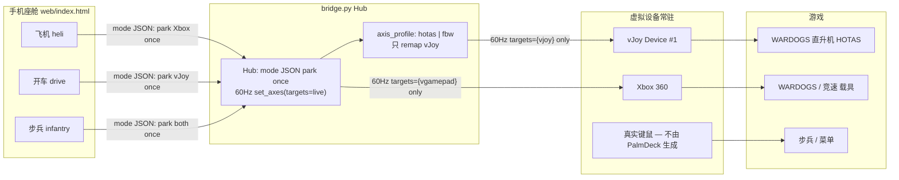
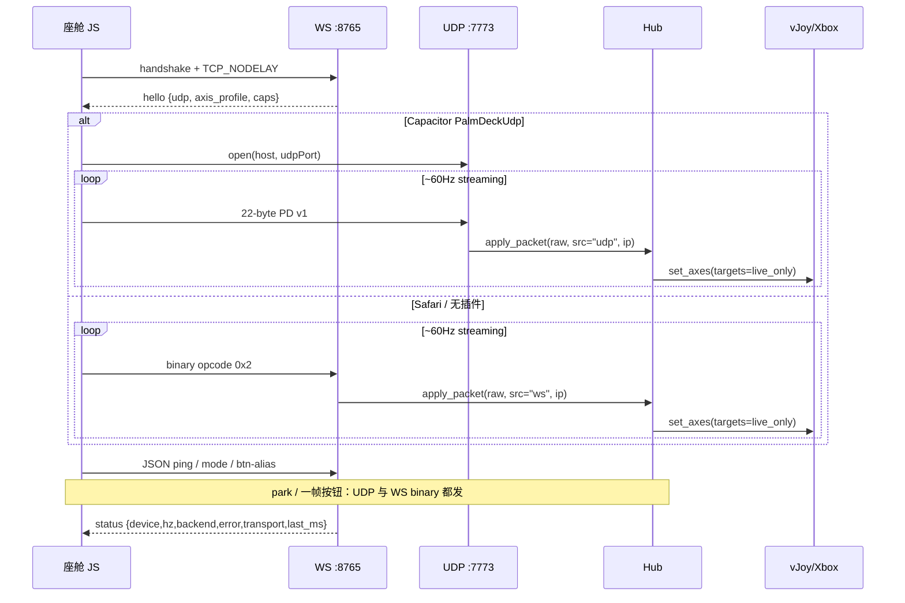
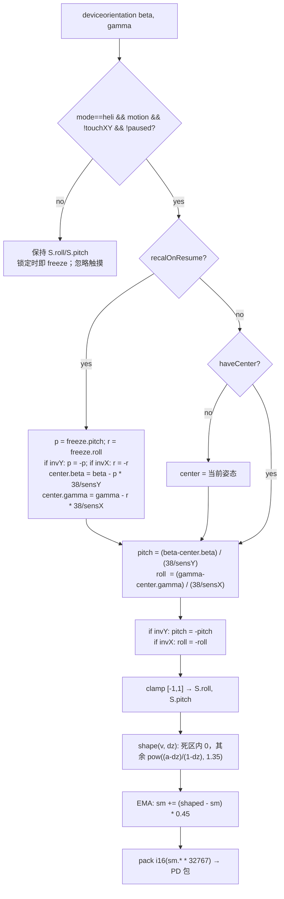
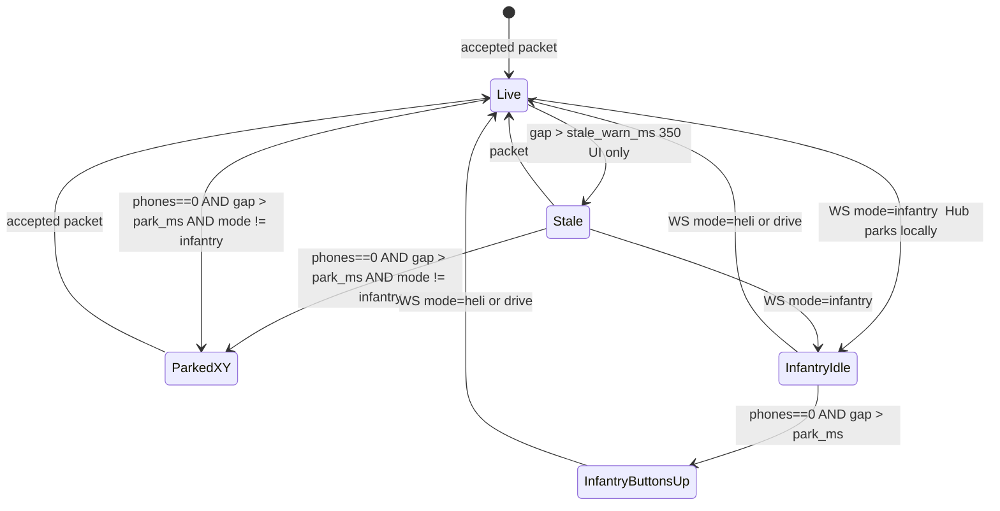
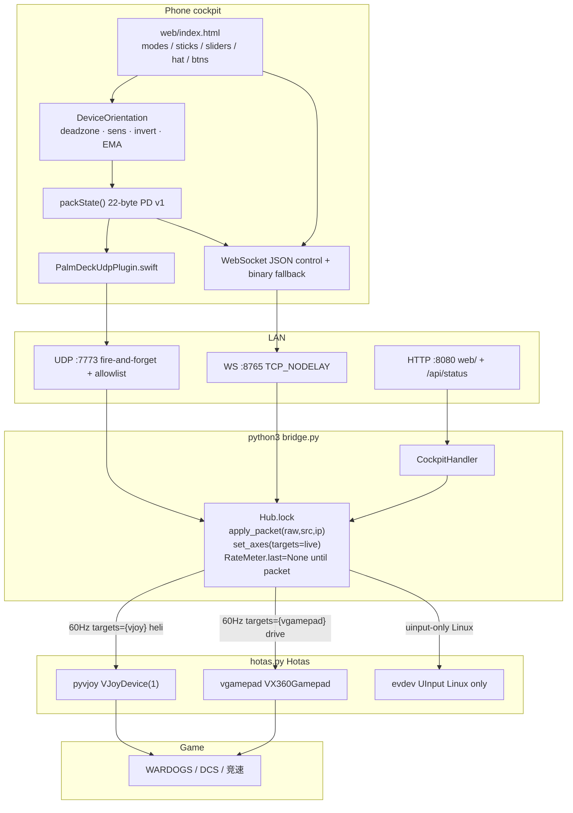

# PalmDeck v3 软件功能设计

| 字段 | 值 |
|---|---|
| 文档 | PalmDeck Software Feature Design (v3) |
| 作者 | TBD |
| 日期 | 2026-09-22 |
| 状态 | Draft |
| 代码根 | `/Users/hui/Downloads/PalmDeck` |
| 产品版本目标 | 3.0（`bridge.py` hello 已声明 `"version": "3.0"`；增量 PR 仍用 `3.0`，能力靠 hello 字段存在与否探测，见 §API） |

本文是可落地的产品 + 工程规格：每个功能写清用户可见行为、输入、对 vJoy / Xbox 的输出、以及断线 / 锁定 / 校准 / Wi-Fi 掉线的边角。标识符、路径、协议字段保持英文。

---

## Overview

PalmDeck 把手机做成 PC 游戏的驾驶杆（yoke / HOTAS / 方向盘），不是通用手柄壳。交付物固定两件：

1. **电脑端**：Windows 主目标。现在是 `python3 bridge.py` / `start.bat`，可打成 `PalmDeck.exe`（`packaging/PalmDeck.spec`）。它在本机创建虚拟设备，并在局域网收手机包。
2. **手机座舱**：Web 座舱 `web/index.html`（HTTP `:8080`），以及 Capacitor 6 iOS App `com.palmdeck.yoke`。Android 计划中，同一套 `web/`。

热路径已经是 FBW 同类系统：22 字节 little-endian `PD` 包、UDP `:7773` fire-and-forget、无 JSON；Safari 没有原生 UDP 时走二进制 WebSocket `:8765`（`TCP_NODELAY`）。电脑在驱动可用时**同时创建并常驻** **vJoy Device #1**（飞机 / HOTAS）和 **Xbox 360**（`vgamepad` / ViGEm，开车），但 **v3 按座舱模式门控写入**：`mode` JSON 上对未用设备 **park 一次**；之后 60Hz 只 `set_axes(..., targets={live})`，飞机路径 **不得** 每帧 `VX360Gamepad.update()`。步兵继续用电脑键盘鼠标，手机不得抢输入。

v3 要做的不是换皮，而是把已经验证的 FBW **系统逻辑**写成稳定合同：产品模式、轴预设、发现与重连、锁定 / 校准 / 限位振动、双虚拟设备绑定、控制台可观测性。默认轴图保持现有 PalmDeck HOTAS（WARDOGS 已按此绑）：`roll→X, pitch→Y, throttle→Z, yaw→Rz, brakes/lt→Slider`。另提供命名预设 `fbw`（`Z=rudder, Slider=throttle`），禁止 silently 混出第三套图。

---

## Background & Motivation

### 当前状态（代码即规格）

| 层 | 文件 | 现状 |
|---|---|---|
| Hub / 传输 | `bridge.py` | HTTP 8080、WS 8765、UDP 7773；`PKT = struct.Struct("<2sBB8hH")`；`Hub.apply_packet` / `Hub.axes`；`RateMeter`；`/api/status`；`serve_udp` 丢弃 `_addr`、无锁、无 failsafe |
| 虚拟设备 | `hotas.py` | 同时 `_try_vjoy` + `_try_vgamepad`；每个 `set_axes` 写**所有** `_devs`；Linux 才 `_try_uinput`；Mac 通常 `backend=none` |
| 座舱 | `web/index.html` | 只有飞机 / 开车两页；体感、锁定、校准、10 键、4 向 hat、油门 / 舵滑条、死区灵敏度反转、二进制包、iOS UDP 插件、Safari 二进制 WS；rAF 无条件 `pushPacket` |
| 控制台 | `web/host.html` | 二维码走 `api.qrserver.com` 且 `dataset.done` 永不重画；设备、后端、手机数、Hz、IP、错误文案；1.5s 轮询 `/api/status` |
| iOS | `mobile/ios/App/App/PalmDeckUdpPlugin.swift` | `open/send/close`；`SceneDelegate` 适配 iOS 多 Scene；`ios/App/App/capacitor.config.json` 的 `packageClassList` 为 `[]`（发布阻断） |
| 启动 | `start.bat`, `start.sh` | Windows 静默 `pip install pyvjoy` 后跑 `bridge.py`（不装 `vgamepad`） |

已落地的 FBW 课：

- 飞机模式用 `deviceorientation` 体感当杆。
- 「锁定」**保持**当前 XY，不回中；解锁时按冻结俯仰（先还原 invert）重算 `center`，升降舵连续。
- 限位振动只在 `S.live`（已连电脑）时 `navigator.vibrate(18)`。
- 控制台显示收包 Hz。
- iOS 原生 UDP；Safari 退回二进制 WS。
- 10 个可改名按钮、4 向 hat、油门 + 舵、灵敏度 / 死区 / 反转。

### 痛点

1. **模式不完整**：座舱只有「开车 / 飞机」。步兵被说明成键鼠，但 rAF 仍以 ~60–80Hz 向 Xbox 灌零摇杆，部分游戏会因此切到手柄、抢走 WASD。README 仍写「步兵认 Xbox」，v3 改为键鼠，文档必须对齐。
2. **开车刹车不在热路径包里**：`#handbrake data-btn="b"` 不匹配 `/^b(\d+)$/`，**不进 `btnMask`、不置 `S.lt`**，只在 WS 文本 `{"type":"btn","name":"b"}` 里发。iOS 在 `ws.onopen` 之后仍握着 WS，所以今天 **不会**在 UDP 路径上丢 B 键；真实缺陷是 (a) 模拟 LT 永远为 0，(b) 按钮与轴包不同步，(c) 未来 UDP-only 客户端会丢这个键。不要据此去「UDP 上发 JSON」。
3. **轴语义两套**：FBW 是 `Z=rudder, Slider=throttle`；PalmDeck / WARDOGS 是 `Z=throttle, Rz=yaw`。必须命名预设，不能 silently 改默认。
4. **无 failsafe**：UDP 无会话。手机锁屏 / Wi-Fi 闪断后，vJoy 停在最后一帧（集体距可能停在高位）。`main()` 是 `sleep(1)`，没有定时器，沉默时 `apply_packet` 根本不跑。
5. **发现体验**：QR 依赖 `api.qrserver.com`；IP 从 `127.0.0.1` 变成 LAN 后不重画；无局域网 beacon（FBW 做过又没出货）。
6. **休眠**：`navigator.wakeLock` 只请求一次，`visibilitychange` 不重拿；iOS 未设 `idleTimerDisabled`。
7. **双设备交叉喂入**：`Hotas.set_axes` 对每个包同时写 vJoy 和 Xbox。飞机时 Xbox LS=周期变距；开车时仍开着的 HOTAS 绑定会把方向盘当周期变距。

### 约束

- **不撤 PC 游戏线。** WARDOGS：直升机 HOTAS（vJoy）、地面载具 Xbox、步兵键鼠。
- 虚拟设备出在 Windows。Mac 上 `backend=none` 只做演示 / 连调，不假装有手柄。
- 学 FBW 的系统逻辑，不抄 UI、广告、IAP。
- 默认轴预设保持 `hotas`。`fbw` 只作为用户显式选择的命名预设。

---

## Goals & Non-Goals

### Goals

- 三种产品模式可切换：**飞机**、**开车**、**步兵**。电脑按驱动情况**常驻** vJoy 和 / 或 Xbox；`mode` 消息 **一次性** park 未用设备；60Hz 只写 live `targets`，禁止对未用垫 60Hz 灌零（那会重演 WASD 抢占）。
- 热路径保持 22 字节 `PD` v1。JSON 只做控制面（hello / status / ping / mode / 设置）。二进制 `rt` 始终是权威模拟量，Hub **绝不**把 `rt==0` 当成「用 throttle 填 RT」。
- 默认轴预设 `hotas`（WARDOGS）；可选 `fbw`。电脑端只 remap **vJoy**。手机包字段不改名。
- 连接：本地 QR（URL 变化重画）、IP+端口、上次成功地址；LAN beacon 可选、默认关。
- UDP 源允许列表默认开：空名单 + 未开 `--open-udp` = 丢弃。断线后的 `:7773` 不得比在线时更开放。
- 体感管道、锁定 / 校准 / 限位振动、滑条 / hat / 10 键行为写成合同，含边角。
- 控制台：设备、手机数、Hz、IP、UDP、错误、轴预设、距上一包时间、传输路径。
- iOS UDP / Safari 二进制 WS；断线重连；屏幕常亮。
- 设置持久化；HID 序号稳定（游戏绑的是 index，不是中文标签）。

### Non-Goals

- 不是 MFi / 官方 Game Controller。
- v1 不做 USB 有线 tethering（Lightning / USB-C HID gadget）。
- 不把步兵改成手机虚拟键鼠，不替换 WASD / 鼠标。
- 不复制 FBW 的营销页、IAP、封闭协议或 UI 布局。
- 不在 Mac 上做 vJoy / ViGEm 替代品（v3 仍 `backend=none`）。
- 不在热路径上引入 JSON、protobuf、加密隧道。
- 不做云存档、账号、跨网联机。
- Android 可共用 `web/`，但 v3 不以 Play 上架为门禁。
- 不自动改游戏内绑定文件。
- 不按模式热插拔 ViGEm / vJoy 设备。

---

## Product modes

三种模式是**座舱产品模式**，不是电脑上的三个进程。Windows 在驱动可用时同时创建（启动一次，直到进程退出）：

- `vJoy Device #1`（`hotas.py` `_try_vjoy` / `_autoconfig_vjoy`：轴 `X Y Z Rx Ry Rz Sl0`，16 键，1 个 discrete POV）
- `Xbox 360 Controller`（`vgamepad.VX360Gamepad`）

用户在座舱顶栏切换。默认 **飞机**（与现在 `S.mode="heli"`、`data-mode="heli"` 带 `class="on"` 一致）。



### 写入门控（Alternative F，采用）

设备**不**随模式创建 / 释放。热路径拆成 **两次调用**，禁止把 park 写进 60Hz 循环（否则飞机时每帧 `VX360Gamepad.update()` 中心报告 = 步兵要消灭的 WASD 抢占）：

1. **仅在** `{"type":"mode"}`（以及 Hub 侧步兵 / failsafe recipe）：对**未用**后端 one-shot `park_*`。
2. **每一帧** PD / JSON `axes`：`set_axes(..., targets={live_only})`。飞机 **不得** 调用 `VX360Gamepad.update()`；开车 **不得** 写 vJoy。

「保持 park 零」= *自上次 mode enter 起未再触摸该后端*，不是 *每帧重写零*。

| `cockpit_mode` | 60Hz `targets` | mode JSON 时对另一只 | 缺后端时的降级（该模式的 live） |
|---|---|---|---|
| `heli` | `{vjoy}`（`axis_profile` 生效） | **一次** Xbox park：LS/RS/LT/RT=0，键松开，然后不再 `update()` | 无 vJoy → live=`{vgamepad}`，用 **降级飞机 Xbox 表**（§7）：LS=周期变距，**RT=`thr`（总距）**，开火 `rt>0.5`→B，LT=`lt`。控制台提示装 vJoy。不是第三张 vJoy 预设 |
| `drive` | `{vgamepad}` | **一次** vJoy park：轴回中、键松开、Z/Slider=0，然后不再写 | 无 Xbox → live=`{vjoy}`，X/Y + Z + Slider。控制台提示装 ViGEm |
| `infantry` | 无 60Hz。1Hz heartbeat / 一帧按钮见步兵状态表 | **一次** `park_infantry_all_zero()`（两只模拟量；按钮不打边沿） | uinput-only：live=`{uinput}`，步兵仍 park 一次并停 60Hz |
| `unknown`（旧座舱，无 `mode` 消息） | **两只都写**（今日行为，兼容） | — | 同今日 |

Linux **uinput-only**（`hotas.py` `_try_uinput` 仅在 `_devs` 空时）：所有模式的 live=`{uinput}`（与 `unknown` 一样只写这一只）；步兵仍 park 一次 + 停 60Hz。不是 WARDOGS 路径。

未使用设备 idle pose 是 **零 / 中心**（mode enter 写一次），不是 last-value。

**Hub 启动：** `cockpit_mode="unknown"`，`live_targets=all`（仅兼容旧座舱：从不发 `mode`，两只都写）。**v3 座舱不得走这条路径。**

**所有模式切换（含 heli↔drive）以及每次 WS `onopen`：** 走同一 helper `awaitModeAck(name)`（见下）。手机不能、也不需要本地 park HID。Hub 收到合法 `mode`：立即 one-shot park 未用后端、切换 `live_targets`，然后 **必须 `broadcast` 一条带新 `cockpit_mode` 的 `status`**（锁内拷 `listeners`，锁外 `send`，与 connect 同一条路）。今日 `bridge.py` 只在 accept/disconnect 推 `status`、且发生在读到 `type:mode` **之前**——不补这条 ack，v3 座舱会永远等。

**`awaitModeAck(name)`（onopen 与切模式共用；真门闩是客户端停流）：**

`hello` **不参与** 新旧 Hub 判定（新 Hub 的 hello 也没有 `cockpit_mode` 键）。只看 **`type:status`**。

```
S.streaming = false
ws.send({type:"mode", name})
st = first type:status after this send, or 1000ms timeout
if timeout:
  toast「模式确认超时，仍继续」
  goto stream
if !("cockpit_mode" in st):          // 旧 Hub：connect status 无此键
  goto stream                        // A26，100ms 级开流
// 新 Hub：connect status 带 cockpit_mode:"unknown"，随后 mode 后再推一条
wait until a status has cockpit_mode === name, remaining time of same 1s budget
if timeout: toast；goto stream
stream:
  if (name !== "infantry") { openUdp(); S.streaming = true }
  // infantry: streaming 保持 false；3× park 用 send(force=true)
```

**会话起跑：**

1. `ws.onopen`：`S.hubAcksMode = false`（**每条 WS 重置**）；`retry=0; live=true`；`awaitModeAck(S.mode)`（默认 `heli`）。
2. **禁止**在 helper 返回前 `openUdp()`，也禁止用 `hello` 或 onopen 同步检查把 flag 当 true/false。
3. `onmessage`：忽略 `hello` 对 `hubAcksMode` 的影响。仅 `type==="status"`：若对象 **有** `cockpit_mode` 键则 `S.hubAcksMode=true`（值可为 `"unknown"`）。
4. 切模式时本条 WS 通常已见过带键的 `status`，helper 仍先停流再发 `mode`，再等 **下一条** 匹配的 `status`（Hub 在 `type:mode` 后 broadcast）。

新 Hub connect 顺序：`hello`（无 `cockpit_mode`，忽略）→ `status{cockpit_mode:unknown}`（进入 wait）→ 客户端已发出的 `mode` 被处理 → `status{cockpit_mode:heli}` → `openUdp`。旧 Hub：第一条 `status` 无该键 → 立即开流。

### 飞机 / 模拟飞行（`heli`）

- **谁用**：WARDOGS 直升机、通用飞行模拟。绑定 **vJoy**，游戏内 Enable HOTAS。
- **手机**：体感（或触摸姿态球）= 周期变距 / 升降副翼；左滑条 = 油门 / 总距；右滑条 = 方向舵；hat = 视角；10 个飞行按钮。
- **Xbox**：mode enter **一次** park 后，飞机 60Hz **完全不碰** Xbox（无 `update()`）。文档：**飞机绑 vJoy，不要绑这只 Xbox**。Steam Input 对 WARDOGS 必须关。
- **开火**：双设备 / vJoy live 时 **不是** Xbox RT（RT 被 park，写了也丢）。Hub 把包里 `rt>0.5` 译成 **vJoy button 16**（见 §5）。仅「无 vJoy」降级才走 Xbox B。
- **切换进入 / 离开**：`awaitModeAck("heli"|"drive")`（停流 → `mode` → status 对齐或旧 Hub 立即放行 → 再流）。不强制改油门。飞机若体感仍开，`recalOnResume=true`。

### 开车（`drive`）

- **谁用**：WARDOGS 地面载具、普通竞速。绑定 **Xbox 360**。
- **手机**：左大摇杆 = 转向 / 前后；右列油门滑条；刹车键。
- **vJoy**：mode enter **一次** park 后，开车 60Hz **不写** vJoy。无 Xbox 时才降级 live=`{vjoy}`。
- **体感**：开车默认关闭。若用户先开了飞机体感再切开车，停止把 orientation 写进摇杆，避免手机平放时把车打满舵。

### 步兵（`infantry`）— 电脑键鼠，手机不抢

- **谁用**：地上走路、菜单、买装备。输入源是 **PC 键盘鼠标**，不是手机，也不是 Xbox。
- **用户可见**：第三枚模式键「步兵」（`button[data-mode="infantry"]`）。`#page-infantry` 中区文案「电脑键鼠操作中」；`#steer`、姿态球、两根滑条 `pointer-events:none` + 视觉禁用。
- **输出（顺序钉死，见 §步兵状态表）**：先 WS `mode`，Hub **本地 park**；再双通道 park 包 ×3；然后停 60Hz；1Hz heartbeat。
- **按钮**：允许点 10 键 / hat 作为快捷，**只写 vJoy**（不写 Xbox，避免 1Hz/按键 `update()` 再抢 WASD）。`hold()` 必须自己 `pushPacket` 一帧。
- **切回飞机 / 开车**：先 WS `mode`（Hub park 未用设备），再 `S.streaming=true`。飞机若体感仍开，`recalOnResume=true`。

这是相对现状的明确行为变化：现在切模式只把 `S.roll/pitch/...=0` 后继续 `send()`，Xbox 会一直收到中心摇杆。

### 电脑如何「广告」设备

| 平台 | 广告 |
|---|---|
| Windows，vJoy + ViGEm 都在 | `backend=vjoy+vgamepad`，`device="vJoy Device #1 + Xbox 360"`。两只设备常驻，不随模式卸载。模式改变**写哪一只**和**是否流轴**。 |
| 仅 vJoy | 飞机可用；开车降级写 vJoy。控制台提示「未检测到 Xbox，开车请装 ViGEmBus + `pip install vgamepad`」。 |
| 仅 ViGEm | 开车可用；飞机走 **降级 Xbox 表**（LS=周期变距，RT=总距/`thr`，开火→B）。控制台提示装 vJoy。 |
| Mac / 无驱动 | `backend=none`。座舱可连、可显示 Hz，游戏里无设备。错误文案保持现有：「未检测到 vJoy / ViGEm / uinput，游戏里不会出现设备」。 |

不按模式动态 `VJoyDevice` / `VX360Gamepad` 重建。创建成本高，且 WARDOGS / Steam 会把设备消失当成拔手柄。

---

## Feature list（行为规格）

下列每条都是实现合同。未写「v3 新增」的，是把现有 `web/index.html` + `bridge.py` + `hotas.py` 钉死，并补边角。

### 1. 连接与发现

**用户可见**

1. 电脑打开 PalmDeck，浏览器弹控制台 `http://127.0.0.1:8080/`（`web/host.html`）。
2. 控制台显示本机 LAN IP、手机 URL `http://{ip}:8080/index.html`、二维码。
3. 同一 Wi-Fi：Safari 扫码，或 App 填 IP。
4. 顶栏圆点变绿，文案为 `{device} · {hz}Hz`。失败为琥珀色 + 错误。

**输入**

- QR 内容：仅 HTTP 座舱 URL（不是 ws://）。与现在 `host.html` 一致。
- 手动：IP + WS 端口（默认 `8765`）。完整 `ws://` 仍可粘贴。
- 上次成功地址：`localStorage.palmdeck_ws`。
- Capacitor / `file:` / `localhost`：不把 `location.hostname` 当电脑 IP，沿用已存地址，否则占位 `192.168.3.103` 并弹出连接 sheet。
- 从电脑 HTTP 打开的 Safari：`defaultHost()` 用 `location.hostname`。

**QR 实现（v3，无 CDN）**

- 在 `host.html` **内联**一份无依赖的 QR 编码器（Kaywa / nayuki 一类 MIT 小函数，直接贴进 `<script>`，不 npm、不请求 `api.qrserver.com`）。
- 用 `<canvas>` 画 200×200。比较 `dataset.url` 与当前 `phone` URL，**变化就重画**（修掉今日 `dataset.done` 在 `lan_ip()` 仍是 `127.0.0.1` 时永远不更新的洞）。
- 编码器失败：canvas 上写 URL 文本，复制按钮仍可用。

**输出**

- WS 握手成功后服务器发（旧座舱忽略未知字段）：

```json
{"type":"hello","product":"PalmDeck","version":"3.0","udp":7773,
 "axis_profile":"hotas","http":8080,"park_ms":2000,
 "caps":["failsafe","profile","allowlist"]}
```

`version` 保持 `"3.0"`（代码已发出）。混用旧 exe / 新网页时，用 **`axis_profile` / `caps` 是否出现** 当能力位，不bump 主版本。`park_ms` 是电脑 failsafe 的告知值；**座舱不根据它 park**（park 只发生在 Hub）。

- iOS：`hello.udp` → `PalmDeckUdp.open({host, port})`，随后热路径走 UDP。若后续 hello/`status` 里 `udp` 端口变化：先 `close()` 再 `open()` 新端口（并保持 idle timer）。
- Safari：无 `Capacitor.Plugins.PalmDeckUdp`，热路径 `WebSocket.send(ArrayBuffer)`。

**边角**

| 情况 | 行为 |
|---|---|
| 电脑防火墙拦 8080/8765/7773 | 座舱连不上或只有 WS 无 Hz。控制台 `phones=0`、`hz=0`。提示检查防火墙与是否同一网段。 |
| Clash fake-ip `198.18/198.19` | `lan_ip()` 已拒绝（`_usable_lan`），避免 QR 印不可达地址。 |
| `169.254` / `127.` | 同样拒绝；回退 `127.0.0.1` 只给本机预览。QR 在 IP 变成 LAN 后重画。 |
| 访客 Wi-Fi 隔离 / 电脑开热点部分机型 | 扫码能开页但 WS 失败。第 2 次重连失败后（已有 `isPackaged() && S.retry===2`）弹出 IP sheet。Safari 同样在 `retry>=3` 时弹出（v3 补上，现在只 packaged 弹）。 |
| QR 生成失败 | 见上：文本 URL 回退。 |
| 手输 IP 错 | 重连 backoff：`600 + retry*400` ms，封顶 4s（现逻辑保留）。 |
| LAN beacon | **默认关闭。** 见 Open Questions。若打开：电脑 UDP 广播或 mDNS `_palmdeck._udp`，App 列表选主机；不能替代 QR/IP。 |

**非目标**：UPnP 打洞、跨网关连接。

---

### 2. 传输选择（iOS UDP vs Safari 二进制 WS）



规则：

1. **轴、hat、buttons 1–10、扳机只走 `PD` 包。** JSON `axes` / `btn` / `cmd` 保留给旧客户端和别名键，新座舱热路径不得依赖它们。开车刹车 v3 进 `btnMask` bit1 + `lt`，不再靠 `btn:"b"`。
2. WS 仍要连：hello、status、Hz 显示、模式上报、作为 UDP 失败回退、**步兵 park 的可靠通道**。
3. `openUdp()` 失败：`S.udpReady=false`，自动用二进制 WS。不向用户报「UDP 失败」，只在控制台 `transport` 字段区分 `udp` / `ws`。
4. **`transport` / `last_src` 合同**（实现必须把源传进 Hub）：
   - 签名：`apply_packet(raw, src: "udp"|"ws", ip: str)`。`serve_udp` **必须**把 `addr[0]` 传进来（今日丢弃 `_addr`）。
   - JSON `axes` / `btn` / `cmd` 也 `rate.tick()`，`last_src="ws"`。
   - `/api/status` 计算：若 `now - last_udp_mono < 1s` → `transport="udp"`；else 若 `now - last_ws_mono < 1s` → `transport="ws"`；else `transport="idle"`。
   - `--open-udp` 且无 WS：`phones=0`、`transport=udp`、`hz>0` 是**合法**画面，hint「UDP 调试，无 WebSocket」。不要画成「没连手机」。
5. **双通道发送策略**
   - 60Hz 热路径：`udpReady` 则只 UDP（省 WS 带宽）；否则 WS binary。
   - park 突发、步兵 1Hz heartbeat、步兵一帧按钮：**UDP 和 WS binary 都发**（`pushPacket(buf, {both:true})`）。

---

### 3. Motion / tilt 管道

仅 **飞机** 且用户点过「体感」。iOS 必须用户手势触发 `DeviceOrientationEvent.requestPermission()`（现有 `enableMotion()`）。



解锁重校准必须先把 freeze 按 `invX`/`invY` 还原再算 `center`（与 `web/index.html` ~410–414 一致）。上面简化式 `center.beta = beta - freeze.pitch * 38/sensY` **只有 inv 全关时成立**。

**常量（钉死，不要无声改）**

| 参数 | 值 | 位置 |
|---|---|---|
| 满轴倾角 | `38° / sens` | `onOrient` |
| 默认 `sensX/sensY` | `1.0`，UI 范围 `0.4–2.2` step `0.05` | 设置页 |
| 默认死区 `dz` | `0.06`，范围 `0–0.20` | `shape()` |
| 曲线指数 | `1.35` | `shape()` |
| XY EMA | `0.45` | `send()` |
| yaw EMA | `0.50`，死区 `0.08` | `send()` |
| look 死区 | `0.05`，**不走 EMA**（hat 是数字 ±1，EMA 会拖出 POV） | `packState` `shape(S.look_x, 0.05)` |
| 发包节流 | `now - S.last < 12` ms（约 83Hz 上限） | `send()` |
| 实际频率 | `requestAnimationFrame` + 节流，目标 **60Hz** | 控制台 Hz |
| 触摸覆盖 | `S.touchXY` 时 orientation 不写 XY；松手若 `motion && !paused` 回到体感，不回中 | `endAtt` |
| 锁定中触摸 | **忽略** `applyAtt` / `endAtt`（`#btnPause` 除外） | v3 修 `endAtt` 今日会把 freeze 打成 0 的洞 |

**输入**：`DeviceOrientationEvent.beta`（俯仰）、`.gamma`（横滚）。不用 `alpha`，不用加速度计当杆（避免高频抖动）。权限文案已在 `Info.plist`：`NSMotionUsageDescription`。

**输出**：语义轴 `roll/pitch ∈ [-1,1]` → 包字段 → Hub → 默认 `hotas` 下 vJoy X / Y（Y 在 `hotas.py` 已 `set_axis(Y, _vjoy_axis(-pitch))`，抬头为正）。

**边角**

| 情况 | 行为 |
|---|---|
| 拒绝运动权限 | toast「没有体感权限…」，`S.motion=false`，仍可用触摸姿态球。 |
| 无传感器 | toast「这台设备不支持体感」。 |
| 横竖屏切换 | 用户点「校准」。不在 `orientationchange` 自动校准（避免转弯时突然回中）。 |
| 开车模式 | `onOrient` 直接 return（现有 `mode!=="heli"`）。 |
| 手指按在姿态球上（未锁定） | 触摸覆盖体感；松手恢复体感，杆位接当前姿态，不跳 0。 |
| 手指按在姿态球上（已锁定） | 忽略触摸。`S.roll/pitch` 停在 freeze。rAF 继续发 sm。 |
| Safari 后台 | orientation 停。回到前台：若锁定则继续 freeze、**不**设 `recalOnResume`；否则 `recalOnResume` 一次。 |

---

### 4. 锁定 / 校准 / 限位振动

#### 锁定（`btnPause`，「锁定」）

FBW：Pause XY **holds** current output；unpause recalibrates Y。

| 动作 | 行为 |
|---|---|
| 未开体感时点锁定 | 先 `enableMotion()`（现有）。 |
| 进入锁定 | `S.paused=true`；`S.freeze={roll,pitch}` 当前值；`onOrient` return；rAF **继续发 freeze 后的 sm 轴**（不回中）。姿态球变暗，按钮文案「已锁」，hint「体感已锁定」。 |
| 解锁 | `S.paused=false`；`S.recalOnResume=true`；下一帧 orientation 用 **invert-aware** 公式把 `center` 设成「当前姿态对应 freeze 杆位」，俯仰连续。toast「体感恢复，俯仰已接上」。 |
| 锁定期间油门 / 舵 / 按钮 | 仍可用。锁定只冻 XY。 |
| 锁定期间触摸姿态球 | 忽略（含 pointerup）。**禁止**走今日 `endAtt` 的 `S.roll=0; S.pitch=0`。 |
| 锁定期间断线 | freeze 值留在手机；重连后继续发同一 XY，不自动解锁。 |
| 锁定期间 `visibilitychange` visible | **不**设 `recalOnResume`。 |

#### 校准（`btnCal`）

- `haveCenter=false`，`S.roll=S.pitch=0`，`sm.roll=sm.pitch=0`，立即 `send()`。
- 下一帧 orientation 把当前握持当作 XY 中心。
- toast「已按当前姿态校准」。
- **不**改油门、舵、按钮。
- 锁定中点校准：先视作解锁语义还是保持锁定？**保持锁定**，校准被忽略（或 toast「先解锁再校准」）。避免把 freeze 清掉却仍 paused。

#### 限位振动

- 条件：`S.live===true` 且 `|sm.roll|>0.97` 或 `|sm.pitch|>0.97`，上升沿 buzz 18ms。
- 未连接（含 `backend=none` 的演示）**不振动**（现有 `buzz` 已判断 `S.live`）。
- 轴离开限位后 `atLimit=false`，可再次触发。
- iOS 无振动马达的机型：静默失败。
- 不在油门 / 舵满行程振动（避免直升机总距拉满时一直震）。

---

### 5. 滑条、hat、10 按钮

#### 油门（左滑条，飞机 + 开车共用语义字段 `throttle`）

- 范围 `[0,1]`，默认飞机 `0.35`。
- 「悬停」键：写 `0.42`（现有 `btnHover`），不切换模式。
- 松手 **保持**（不回中）。这是集体距 / 油门，不是弹簧杆。
- 包：`thr` int16 = `round(throttle * 32767)`。Hub：`throttle = clamp(thr/32767, 0, 1)`。
- 默认 `hotas`：**vJoy `Z`** = `throttle*2-1`（中点 50%）。Xbox RT **只**看包里的 `rt` 字段（见真值表），**没有**「`rt` 缺省则用 throttle」这条二进制路径。JSON `axes` 里 `rt` 省略时，旧 Hub 的 `rt is None` 分支仍可给旧网页用，新座舱不发 JSON `axes`。
- `fbw` 预设：同一 `throttle` 改写 vJoy **Slider**。Xbox 映射不吃 `fbw`。

#### 方向舵（右滑条，仅飞机页）

- 有符号 `yaw ∈ [-1,1]`，视觉滑条 0.5=中。
- 「回中」：`yaw=0`。
- 松手保持（与现 `attachThr(..., "yaw", true)` 一致，无 pointerup 回中）。
- 包：`yaw` int16。默认 vJoy **Rz**；`fbw` 下 vJoy **Z**。
- Xbox：仅 `drive` 或降级 heli 时才写。无独立 look 时，右摇杆 X = yaw（现有 `look_x if look_x or look_y else yaw`）。hat 按下时 look 优先。

#### 开车刹车

现状（准确描述）：`#handbrake data-btn="b"` → `hold("b")` 走 WS JSON → `tap_button("b")` → Xbox B / vJoy 2。iOS UDP **不会丢这个键**（WS 仍在）。缺的是 LT 与原子性。

v3 合同：

- `#handbrake` 改为 `data-btn="b2"`。按下：`btnMask` bit1，且 `S.lt=1`；松开：清 bit1，`S.lt=0`。每帧进 PD 包。
- 标签仍「刹车」。HID：Xbox B + LT，以及（仅当开车降级到 vJoy 时）vJoy button 2 + Slider 满。
- JSON `btn:"b"` 仅作旧客户端遗留；新座舱热路径不发。

#### 4 向 hat

- 包 `hat`: `0 up, 1 right, 2 down, 3 left, 255 none`（`HAT_NAME` / 座舱 `hats` 已一致）。
- 同一时刻只能一个方向。松开写 255。
- vJoy：`set_disc_pov(1, pov)`，松开 `-1`。
- Xbox：DPAD_*（仅该模式正在写 Xbox 时）。
- **额外**：按下时 `look_x/look_y = ±1`，松 0。于是 Rx/Ry 也动，给用轴看的模拟器。POV 与 look 轴同时写是有意的，不是 bug。
- 中心「开火」（`#heliFire`，现 `bindTrig(..., "rt")`）：**不是** 10 键之一。包里仍用 `rt=0|1`（不改 PD v1）。Hub 按 live 后端翻译，**双设备 WARDOGS 路径不得丢开火**：
  - **vJoy live（默认双设备 / 仅 vJoy）**：`rt>0.5` → **vJoy button 16** 按下，否则松开。vJoyConfig 已 `-b 16`。不占用 labeled 1–10，也不占用 hat 别名 11–14。`_autoconfig` 不必改。**不写 Xbox RT**（Xbox 在飞机模式已 park，且 60Hz 不 `update()`）。
  - **Xbox live 降级（无 vJoy）**：开火 → Xbox **B**（`tap_button` 边沿）；集体距走 RT=`thr`，见降级表。不把 `rt` 当 RT。
  - 开车：`#heliFire` 不在 DOM 上。

#### 10 个按钮

- 标签只存在手机：默认 `["刹车","视角","自动驾驶","反推","减速板收","减速板放","襟翼收","襟翼放","停机刹车","起落架"]`。改名不改变 HID。
- HID：vJoy buttons **1–10** = `btnMask` bit0–bit9。Xbox：`b1→A, b2→B, b3→X, b4→Y, b5→LB, b6→RB, b7→Back, b8→Start, b9→L3, b10→R3`（`Hotas.X360` / `VJOY_BTN`）。
- 按下置位，松开清位，包每帧带全 mask。Hub 对 `buttons ^ _btn` 做边沿，避免重复 `set_button`。
- 游戏绑定的是「Button 3」，不是「自动驾驶」。文档和控制台必须写清这一点。

**边角**

| 情况 | 行为 |
|---|---|
| 多指同时按 | 允许，mask 按位或。 |
| pointercancel / 系统手势打断 | 该键清位，hat=255。 |
| 切模式 | **清 look 和 hat**（发一帧 hat=255）；**不清**仍按住的 10 键，直到 pointerup。这是相对今日 `web/index.html` ~313（只清轴、hat 可能残留）的行为变化，PR4 必须改。 |
| 断线 | 手机继续本地 UI；重连后下一包带当前 mask。电脑 failsafe 见 §11。 |
| 步兵下 10 键 / hat | `hold()` 内 `send(force=true)` 一帧，见状态表。 |

---

### 6. 开车摇杆 + 油门 + 刹车

**用户可见**：`#page-drive` 左摇杆 + 右油门 + 刹车。无姿态球、无舵滑条、无 10 键网格（v3 保持现状简洁）。

**输入 → 语义**

| 控件 | 语义字段 | Xbox（drive live） | vJoy（仅无 Xbox 降级） |
|---|---|---|---|
| 摇杆 X | `roll` | 左摇杆 X | X |
| 摇杆 Y | `pitch` | 左摇杆 Y（代码 `-pitch`，上推向前） | Y |
| 油门滑条 | `throttle`；**打包 `rt=throttle`** | RT | Z |
| 刹车按下 | `lt=1` + `b2` | LT + B | Slider 满 + btn 2 |
| 松摇杆 | roll=pitch=0 | 回中（弹簧） | 回中 |

正常双设备时开车 60Hz **不写 vJoy**（mode enter 已 park 一次）。

松油门滑条 **不** 回 0（赛车油门可保持）。若 WARDOGS 载具需要松手回 0，设置里加「开车油门回中」开关，默认关。

**边角**：开车时 yaw/look 为 0，除非以后加视角球。切到开车清 yaw，避免上一局舵量变成 Xbox 右摇杆。

> **v4 修订（开车真值表，取代上表相关行）**：v4 iOS 驾驶皮肤把 `pitch` 字段改作
> **离合**（踏板），另加**视角板**。电脑侧 `remap_vjoy` 不变（`Y=-pitch`），
> 因此离合走 vJoy `Y`：滑条 0 → 中位，1 → −1 到底。`yaw` 仍为 0。
>
> | 控件 | 语义字段 | 包字段 | vJoy（`hotas`） | Xbox（drive live） |
> |---|---|---|---|---|
> | 方向盘 | `roll` | `roll` | X | LS X |
> | 离合踏板 | `clutch` | `pitch` | Y（`-pitch`） | LS Y |
> | 油门踏板 | `throttle` | `thr=throttle`，且 `rt=throttle` | Z | RT |
> | 刹车踏板 | `brake` | `lt` | Sl0 | LT |
> | 视角板 | `look` | `look_x`/`look_y` | Rx/Ry | RS |
> | —（清 yaw） | `yaw` | 0 | Rz=0 | RS x 回 0 |
> | 档杆升/降 | 脉冲 | `btnMask` b6/b5 | btn 6/5 | RB/LB |
>

---

### 7. 双虚拟设备与 WARDOGS 绑定

**电脑启动（`Hotas.__init__`）**

1. `_try_vjoy`：`VJoyDevice(1)`；失败则 `vJoyConfig.exe 1 -f -a X Y Z Rx Ry Rz Sl0 -b 16 -p 1` 后再开。需管理员的情况：`start.bat` 提示以管理员运行（现有 使用说明）。
2. `_try_vgamepad`：`VX360Gamepad()`。v3：`start.bat` **同时**尝试 `pip install vgamepad`（现在只装 pyvjoy）。
3. 两者都失败且非 Linux → `none`。
4. 不在模式切换时重建设备。

**WARDOGS 绑定（产品文案，控制台 ol 与 README 对齐；v3 改掉「步兵认 Xbox」）**

1. Steam 对该游戏 **关掉 Steam Input**。
2. 步兵：手机切「步兵」。键鼠走路。Xbox / vJoy 停在零且无 60Hz 流。
3. 上车：手机切「开车」。游戏认 **Xbox 360**。左摇杆转向，RT 油门，LT/B 刹车。
4. 上直升机：切「飞机」。Settings → Gamepad → HOTAS → Enable HOTAS。依次推滚转 / 俯仰 / 拉总距 / 蹬舵，绑到 **vJoy Device**。总距不要开 Self-centering collective。**开火（座舱 hat 中心）→ vJoy Button 16**（不是 Xbox RT，不是 labeled 1–10）。仅无 vJoy 的降级机：开火是 Xbox B，总距是 RT；与开车刹车 B 撞键，只在 ViGEm-only 出现。
5. 菜单 / 买装备：键鼠。

**轴写入 — 默认 `hotas` 预设，仅 live `targets`（与今日 `hotas.py` 标度一致）**

```
vJoy (heli live):  X=roll  Y=-pitch  Z=throttle*2-1  Rx=look_x  Ry=-look_y  Rz=yaw  Sl0=lt*2-1
                   rt>0.5 → button 16 (开火)
Xbox (drive live): LS=(roll,-pitch)  RS=(look or yaw, -look_y)  LT=lt  RT=rt
Xbox (heli degraded, no vJoy): LS=(roll,-pitch)  RT=throttle(thr)  LT=lt  fire(rt>0.5)→B
```

开车 Xbox `RT=rt`：**始终用包里的 rt**（座舱 drive 把 `rt` 打成 throttle）。飞机双设备 **不**把 `rt` 写到 Xbox。

vJoy 轴标度：`_vjoy_axis` → `[1, 0x8000]`，中点 `0x4000`。这是 pyvjoy / GetVJDAxisMax 一类的 1..32768 标度，不是 -32768..32767。不要改成有符号 16 位，否则已有 WARDOGS 绑定全偏。

**风险（高）**：Steam Input 仍可能在设备存在时抢键鼠。缓解：模式门控写入 + 步兵停流 + 文档关 Steam Input。不在 v3 做虚拟设备热插拔。隐藏开关 `release_xbox_on_infantry`（默认 false）留作 Open Question 3。

---

### 8. 电脑控制台

`web/host.html` 轮询 `GET /api/status`，1.5s。v3 字段：

| UI 行 | JSON 字段 | 说明 |
|---|---|---|
| 虚拟设备 | `device` | 如 `vJoy Device #1 + Xbox 360`；`backend=none` 用 `.bad` |
| 后端 | `backend` | `vjoy` / `vgamepad` / `vjoy+vgamepad` / `uinput` / `none` |
| 已连接手机 | `phones` | **WS 连接数**。`--open-udp` 无 WS 时为 0，同时 `transport=udp` 仍算在飞 |
| 收包频率 | `hz` | `RateMeter` 1s 窗口，一位小数。目标 ≥50，健康 ≥55。`<20` 红，`20–50` 黄，`≥50` 绿 |
| 本机地址 | `ip` + `udp` | 现有 `ip · UDP 7773` |
| 轴预设 | `axis_profile` | `hotas` / `fbw` |
| 座舱模式 | `cockpit_mode` | 最后一次客户端 `mode` 消息：`heli`/`drive`/`infantry`/`unknown` |
| 传输 | `transport` | `udp` / `ws` / `idle`（§2 规则 4） |
| 距上一包 | `last_ms` | 在 **GET /api/status 时**计算。`rate.last is None`（从未收过包）显示 `—`，**不**用 `monotonic-0`。有包后 `monotonic - rate.last`；≥ `stale_warn_ms`（350）变黄。**不**在 350ms 改 HID |
| 错误 | `error` | 单槽，优先级见 Observability |

现有操作保留：复制地址、预览手机页、QR。v3：本地 QR 且 URL 变则重画；可选「轴预设」下拉（改 Hub，写 `%APPDATA%` 配置，广播新 `hello`/`status`）。切换预设 **不**重建 `VJoyDevice(1)`。

`CockpitHandler`：`/` + 非 mobile UA → `host.html`；mobile UA → `index.html`。保留。

---

### 9. 设置持久化

**手机 `localStorage`**

| Key | 内容 |
|---|---|
| `palmdeck_cfg` | `{sensX, sensY, dz, invX, invY, labels[]}` 现有 |
| `palmdeck_ws` | 上次 `ws://ip:port` |
| `palmdeck_cfg` v3 增 | `mode`, `thrReturnDrive` (bool, default false), `axisProfileHint`（只显示，真正 remap 在电脑） |

不把油门位置持久化（避免下次开机集体距在满）。

**电脑配置 — 唯一 schema（源文件 `PalmDeck/config.json` 模块，PR2 一次落地）**

路径：Windows `%APPDATA%\PalmDeck\config.json`；macOS `~/Library/Application Support/PalmDeck/config.json`。**禁止**写入 `sys._MEIPASS`（frozen exe 只读）。文件缺失则全默认。CLI **覆盖**文件；flag 名跟 key。

```json
{
  "axis_profile": "hotas",
  "http": 8080,
  "ws": 8765,
  "udp": 7773,
  "host": "0.0.0.0",
  "stale_warn_ms": 350,
  "park_ms": 2000,
  "failsafe_throttle": "hold",
  "udp_allowlist": true,
  "allowlist_ttl_ms": 5000,
  "beacon": false,
  "release_xbox_on_infantry": false
}
```

| key | 默认 | CLI |
|---|---|---|
| `axis_profile` | `"hotas"` | `--axis-profile hotas\|fbw` |
| `http` / `ws` / `udp` / `host` | 8080 / 8765 / 7773 / `0.0.0.0` | 现有 `--http --ws --udp --host` |
| `stale_warn_ms` | 350 | （一般不暴露；仅 UI） |
| `park_ms` | 2000 | `--park-ms 2000` |
| `failsafe_throttle` | `"hold"` | `--failsafe-throttle hold\|center` |
| `udp_allowlist` | `true` | `--open-udp` ⇒ `udp_allowlist=false`（**唯一**收未经 WS 的 UDP 的办法） |
| `allowlist_ttl_ms` | 5000 | `--allowlist-ttl-ms` |
| `beacon` | `false` | `--beacon` |
| `release_xbox_on_infantry` | `false` | 无 CLI；隐藏 |

改 `axis_profile` 立即生效，下一包按新表写 HID，并 `broadcast status`。不重建 vJoy。按钮中文名**不**同步到电脑。

现有 argparse 还保留 `--no-browser`。

---

### 10. Keep-alive / 重连

| 事件 | 行为 |
|---|---|
| WS `onclose` | `S.live=false`, `udpReady=false`，meta「重连中…」，backoff 重连同一 URL。电脑将该 IP 从 **active** 挪到 **recent**（TTL `allowlist_ttl_ms`）。 |
| WS `onopen` | `S.hubAcksMode=false`；`retry=0; live=true`；`awaitModeAck(S.mode)`。**只根据第一条 `status`（不是 hello、不是 onopen 同步检查）** 判断旧/新 Hub。禁止 helper 返回前 `openUdp()`。toast「已连上电脑」。 |
| `hello.udp` 变化（重连后） | 关旧 UDP，按新端口 `open`。 |
| `visibilitychange` → visible | 重连若 WS 非 OPEN（走同一套 onopen：先 `mode` 再 UDP）；重 `wakeLock`；飞机体感**未锁定**才 `recalOnResume=true`。锁定则保持 freeze。 |
| iOS 进后台 | WKWebView 挂起，包停。插件 `open` 时已 `isIdleTimerDisabled=true`；进后台随系统挂起。电脑走 park 定时器。回前台走上一行。 |
| `ping` | JSON `{"type":"ping","t":…}` → `pong`。座舱每 **5s** 一条，仅测 WS，不替代 UDP 热路径。 |
| 多手机 | `phones` = 当前 WS 数。Allowlist = **当前 WS 对端 IP 的集合** ∪ TTL 内刚断开的 IP。`mode_owner_ip` = 最后一条合法 `mode` JSON 的源 IP。**非 owner 的 HID 路径全部丢弃**：PD **以及** JSON `axes` / `btn` / `cmd`（今日 `handle_ws_client` 对 JSON 无 owner 检查，必须补）。`mode` JSON 本身始终处理（所有权转移）。步兵 1Hz heartbeat 在 `cockpit_mode != infantry` 时也丢弃。不支持双人各绑一只杆。`phones>1` 控制台警告「多手机会互相覆盖，不支持」。不假装 session affinity。 |

UDP 无 keep-alive 帧。存活靠 60Hz 轴包。步兵用 `cockpit_mode=infantry`（WS 已送达）+ 1Hz park heartbeat 区分「故意停」和「死了」。若 `mode` JSON 也丢了：只有 WS 断开之后 `park_ms` 定时器才会 park（见 §11）。

---

### 11. 断线、锁屏、Wi-Fi、failsafe

原则：**短中断 hold last（FBW）**；**确认没人连了才 park XY**；**油门 / 集体距不自动拉掉**（直升机突然掉总距比停在最后位置更危险）。`failsafe_throttle` 默认 `"hold"`；`"center"` 把油门收到 0，**禁止**把步兵的「全零」函数拿来当 Wi-Fi failsafe。

两个 named recipes（`hotas.py` / Hub，实现必须分成两个函数）。Hub 在每帧 **accepted** 包上快照 `last_axes`（含 `roll…rt, throttle, lt`）以及 `_btn` / `_hat`。没有快照就无法 hold。

```python
def park_xy_hold_throttle(self) -> None:
    """Wi-Fi / WS-gone failsafe for heli/drive/unknown. Never infantry. Never 60 Hz."""
    if self.last_axes is None:
        return  # 从未收过包：不 park、不报离线
    a = dict(self.last_axes)
    a["roll"] = a["pitch"] = a["yaw"] = a["look_x"] = a["look_y"] = 0.0
    if self.failsafe_throttle == "center":
        a["throttle"] = a["lt"] = a["rt"] = 0.0
    elif self.cockpit_mode == "drive":
        pass  # KEEP throttle, lt, AND rt (drive throttle lives in rt)
    else:
        # heli and unknown: KEEP throttle + lt; FORCE rt=0
        # rt>0.5 would stick vJoy btn16 (开火) / degraded Xbox B
        a["rt"] = 0.0
    self.output_live(a, buttons=0, hat=255)  # also releases btn16 via rt=0 on heli

def park_infantry_all_zero(self) -> None:
    """User is on foot. One-shot analog idle on BOTH devices. No button edges."""
    # roll=pitch=yaw=look=throttle=lt=rt=0; hat POV center on vJoy + Xbox
    # does NOT set_button / press_button — leaves _btn unchanged
    # so a following park PD with held 10-keys does not 1→0→1 tap (A20)

def release_buttons_only(self) -> None:
    """Infantry + phones==0 + park_ms. Analogs already 0; release held shortcuts."""
    # vJoy buttons 1–16 up, POV -1; uinput keys up; NO Xbox.update()
    # _btn=0, _hat=255. Do NOT call park_xy_hold_throttle (would write throttle).
```

`rt` 双义（开车油门 vs 飞机开火）必须 **按 `cockpit_mode` 拆开**：drive hold `rt`（A7b）；heli **清 `rt`** 以松开 btn16，同时 hold `throttle`（vJoy Z / 降级 RT=`thr`）。禁止把飞机开火折进 `park_infantry_all_zero`。

**350ms 不碰 HID。** 它叫 `stale_warn_ms`，只给控制台把 `last_ms` 涂黄。hello 里带 `park_ms` 供能力探测，座舱不执行 park。



`Stale` **没有 HID 副作用**。实现者不得在 350ms 回中 XY。

| 情况 | HID |
|---|---|
| 单帧丢失 / 抖动，`gap < park_ms` | 保持最后轴和按钮。`last_ms ≥ stale_warn_ms` 仅 UI 变黄。 |
| `phones==0` 且 `gap > park_ms` 且 mode 为 heli/drive/unknown | `park_xy_hold_throttle()`（heli：`rt=0` 松开开火；drive：hold `rt`）。`error="手机已离线，杆已回中（油门保持）"`。 |
| `phones==0` 且 `gap > park_ms` 且 mode 为 infantry | **只** `release_buttons_only()`（松开按住的 vJoy 快捷键 / hat）。模拟量已是 0。**不**调用 `park_xy_hold_throttle`，**不**显示「手机已离线」。A20 仍适用于手机还在手上的进入步兵。 |
| 进入步兵 | Hub 一收到 `{"type":"mode","name":"infantry"}` 立刻 `park_infantry_all_zero()`，**不等** PD 包。随后的 park 包是保险。 |
| 锁定中 Wi-Fi 掉 | 电脑 hold freeze 直到 `park_ms` + `phones==0` 才 `park_xy_hold_throttle`。重连后手机仍 paused，继续发 freeze。 |
| 电脑睡眠 | 设备可能被系统暂停。唤醒后 Hub 仍在则下一包恢复；进程被杀需重开 PalmDeck。 |

**定时器（PR1 必须有，不能靠 `apply_packet`）**

今日 `main()` 是 `while True: time.sleep(1)`，沉默时没有任何回调。v3 加 daemon，**100ms** 一轮：

```python
def failsafe_loop():
    while True:
        time.sleep(0.1)
        with HUB.lock:
            if HUB.rate.last is None:      # 启动时 last 不是 0.0
                continue                   # 从未 accepted 包：不 park、不报离线
            gap = time.monotonic() - HUB.rate.last
            if HUB.phones != 0 or gap <= HUB.park_ms or HUB.last_parked:
                continue
            if HUB.cockpit_mode == "infantry":
                HUB.release_buttons_only()    # held vJoy shortcuts up; no Xbox
                HUB.last_parked = True
                continue                      # no 离线 error
            HUB.park_xy_hold_throttle()       # heli: rt=0; drive: hold rt
            HUB.last_parked = True
            HUB.set_error("failsafe", "手机已离线，杆已回中（油门保持）")
```

`RateMeter.last` 改为 `Optional[float] = None`，仅在 **accepted** 包（过 allowlist / owner 检查）上赋 `monotonic`。今日 `last = 0.0`（`bridge.py` ~96）会让 `monotonic-0 ≫ park_ms`，进程一启动就「手机已离线」——禁止。`/api/status.last_ms` 在 `last is None` 时为 `null` / `—`。

下一帧 **被允许的** 包把 `last_parked=False` 并清 failsafe `error`。`last_ms` 在 `/api/status` 读时计算，不需要 350ms 精度的 HID 循环。

**UDP 允许列表（一条政策，三处对齐）**

```
udp_allowlist true（默认）:
  allow(ip) = ip ∈ active_ws_ips  ∪  {ip | now < recent_ws_expiry[ip]}
  空集合（从未有过 WS）→ 丢弃全部 UDP
  --open-udp / udp_allowlist:false → 收任意源（调试专用）
udp_allowlist 在「玩家走开、phones==0」时仍然为 true：
  TTL 过期后该 IP 离开 recent，伪造 PD 无法把杆从 ParkedXY 救回 Live
```

`serve_udp`：

```python
data, addr = sock.recvfrom(256)
HUB.apply_packet(data, src="udp", ip=addr[0])
```

HID 入口统一 owner 检查（PD **和** JSON `axes`/`btn`/`cmd`）：

- `apply_packet`：先 allowlist（`src=="udp"` 且 `udp_allowlist`），再 `mode_owner_ip`（已有 owner 且 `ip != owner` 则丢）。
- `handle_ws_client` 里 JSON `axes`/`btn`/`cmd`：同样要求 `addr[0] == mode_owner_ip`（owner 已设置时）。**`type:mode` 不过滤**——新 IP 的 `mode` 是所有权转移。
- 拒绝则计数，不 `tick()`，不写 HID，不更新 `last_axes`。
- `--open-udp` 且尚无 owner 时不过 owner 检查（旧 UDP 调试 / 旧座舱）。
- 不在 UDP 线程上实现「mode JSON 尚未 parse 则丢 PD」——WS 与 UDP 无共享 pending 位。门闩是 `awaitModeAck` 停流；Hub 侧靠 **mode 处理完立刻 broadcast status**。

---

### 步兵状态表（PR4 实现清单）

今日 `(function tick(){ send(); requestAnimationFrame(tick); })()` 无条件 `pushPacket`。v3：

| 项 | 合同 |
|---|---|
| 标志 | `S.streaming`（heli/drive true，infantry false）。rAF **永远**跑，用于画 knob；仅 `S.streaming` 时 `send()`。 |
| `send(force=false)` | 若 `!force && (!S.streaming \|\| now-S.last<12)` return。EMA / buzz / pack / `pushPacket`。 |
| 进入步兵顺序 | (1) 本地清模拟量（仍按住的 10 键保留）；(2) `S.mode="infantry"`；(3) **`awaitModeAck("infantry")`**（停流 + `mode` + 等 status 或旧 Hub 立即返回）；(4) 然后 `send(force)` park 包 0 / 50 / 100 ms ×3；(5) 1Hz heartbeat `send(force)`。 |
| Hub `mode` | `name in {heli,drive,infantry}`，未知忽略。记下 `mode_owner_ip`。`infantry` → `park_infantry_all_zero()`（只动模拟量 / hat POV，不动 `_btn`）。`heli`/`drive` → one-shot park 未用后端，切换 `live_targets`。**然后必须 `broadcast({type:"status", ... cockpit_mode})`**（connect 那条 `status` 不够：它在读 `mode` 之前就发出了）。不在服务器强制 1Hz cap。 |
| 离开步兵 / heli↔drive | **同一 `awaitModeAck(name)`**：`S.streaming=false` → `mode` JSON → 匹配 `status` 或旧 Hub / 1s 超时 → 再开流。禁止 rAF 在 ack 前继续 UDP（否则开车摇杆会当几帧周期变距）。 |
| `apply_packet` 当 `infantry` | 模拟量强制按 0 写入意图；hat/buttons 用包内值。`targets={vjoy}`（有 vJoy）否则 `{uinput}`，**永不** `{vgamepad}`。若 analog 已是 0 且 `buttons==_btn` 且 `hat==_hat`：**整帧跳过 HID**（1Hz heartbeat 不得 `Xbox.update()`）。按钮边沿只在 mask 变化时 `tap_button` 到 vJoy。 |
| `hold()` | 更新 mask/hat 后：若 `!S.streaming`，`send(force=true)` 一帧（按下和松开）。流轴模式仍靠 rAF。 |
| pack `rt_out` | **先**按模式取，infantry 已把 throttle/rt 置 0：**`heli → S.rt`；`drive → S.throttle`；`infantry → 0`**。禁止 `mode!=="heli" ? throttle : rt` 这种让步兵带上旧油门的写法。 |
| `lt_out` | `S.lt \|\| S.brakes`（步兵为 0）。 |
| DOM | `.modes` 增加 `<button data-mode="infantry">步兵</button>`；`<div class="page" id="page-infantry">` 文案「电脑键鼠操作中」。切页逻辑与现 `page-`+mode 一致。 |
| `mode` JSON 也丢了 | Hub 仍停在上一模式。WS 还在则 `phones>=1`，failsafe **不会** park。1Hz heartbeat 和 3× 突发降低窗口。WS 随后断开 → `park_ms` 后按当时 `cockpit_mode`：heli/drive 走 `park_xy_hold_throttle`；infantry 走 `release_buttons_only`。 |
| 按钮边沿 vs A20 | 切步兵时按住的 10 键必须保持 down。`park_infantry_all_zero` **禁止**先把键打成 0。Hub `_btn` 保持上一帧 mask，直到第一帧步兵 PD；若 mask 相同，XOR=0，无 1→0→1（否则游戏会当成点了一下「自动驾驶」）。 |

---

### 12. Sleep lock（屏幕常亮）

- Web：`navigator.wakeLock.request("screen")`。v3 在 `visibilitychange` 为 visible 时重入。
- iOS：**不**新增第二个插件，也 **不** 在 `SceneDelegate` / `applicationDidEnterBackground` 里改 idle timer（JS 挂起时不会 `close()`，socket 仍开着；后台再 `false` 会和「UDP 仍 open」打架）。只在现有 `PalmDeckUdpPlugin.open()` 里 `isIdleTimerDisabled = true`，`close()` 里 `false`。不暴露 `setIdleTimer`。进后台随系统挂起即可。
- `mobile/capacitor.config.json` 已有 `"packageClassList": ["PalmDeckUdpPlugin"]`。`ios/App/App/capacitor.config.json` 今日是 `[]`——**发布阻断**。PR6 必须修，并在 iOS 清单写死 `npx cap copy ios`，防止 App 副本再漂。
- 不声明后台模式 `audio` 来骗保活。后台就是停包 + 电脑 failsafe。

---

## Proposed Design（架构）



### 模块边界

| 模块 | 职责 | 不职责 |
|---|---|---|
| `web/index.html` | 产品模式、传感器、打包、重连、本地设置、`S.streaming` | HID 标度、vJoy 配置、allowlist |
| `PalmDeckUdpPlugin` | POSIX UDP sendto；`open`/`close` 里 idle timer | 解析 PD、重试策略 |
| `bridge.Hub` | 拆包、Hz、allowlist、failsafe 定时器、mode-enter park、`set_axes(targets=)`、广播 status、轴预设 | UI |
| `hotas.Hotas` | 按 target 写入、park recipes、按钮别名表、vJoy autoconfig | 网络、模式判断 |
| `web/host.html` | 只读控制台 + 本地 QR + 改 profile | 不直接碰 HID |
| `palmdeck_config.py`（新，PR2） | 读/写 schema、CLI 覆盖 | HID |

### 线程与锁

- 主线程：`sleep(1)` 保活（可保留）。
- daemon：`serve_http`、`accept_ws`、`serve_udp`、**`failsafe_loop`（100ms）**。
- 每 WS 连接一线程 `handle_ws_client`。
- **一把 `Hub.lock`** 覆盖所有会改这些字段的路径：`hotas` 写入、`_btn`、`_hat`、`last_axes`、`live_targets`、`mode_owner_ip`、`rate`、`phones`、`cockpit_mode`、`axis_profile`、`last_parked`、`active_ws_ips` / `recent_ws_expiry`、`error` 槽。具体入口：`apply_packet`、JSON `axes`/`btn`/`cmd`/`mode`、`failsafe_loop`、WS connect/disconnect 里的 `phones ±= 1`。
- **`broadcast` 不得在持锁时做网络 I/O**：锁内 `fns = list(self.listeners)`，解锁后逐个 `fn(msg)`。`WsClient.send` 自己的 `client.lock` 不变。
- `Hotas.set_axes` / `tap_button` 仍无内部锁；线程安全由 Hub 保证。

### 性能预算

| 项 | 目标 |
|---|---|
| 发包 | 55–83 Hz（12ms 节流 + rAF）；步兵 1 Hz |
| 包大小 | 22 B；60Hz ≈ 1.3 KB/s |
| Hub 拆包 | `< 0.2 ms` / 包 |
| 体感→HID 单向 | LAN 典型 4–15 ms，不保证；不引入 ACK |
| 控制台轮询 | 1.5 s，`/api/status` 不打日志（已有过滤） |
| failsafe 线程 | 100 ms；持锁时间只做比较 + 一次 park |

---

## API / Interface Changes

### 二进制热路径（布局不变，语义钉死）

```python
# bridge.py
PKT = struct.Struct("<2sBB8hH")  # 22 bytes
# magic 'PD' | ver u8 | hat u8 | roll,pitch,yaw,look_x,look_y,thr,lt,rt i16 | buttons u16
```

| Offset | 类型 | 字段 | 语义 |
|---|---|---|---|
| 0 | `2s` | magic | 必须 `b"PD"` |
| 2 | `B` | ver | **必须 1**。其他值丢弃 |
| 3 | `B` | hat | 0..3 或 255 |
| 4 | `h` | roll | `[-32767,32767]` → `[-1,1]` |
| 6 | `h` | pitch | 同上 |
| 8 | `h` | yaw | 同上 |
| 10 | `h` | look_x | 同上 |
| 12 | `h` | look_y | 同上 |
| 14 | `h` | thr | `[0,32767]` → throttle `[0,1]` |
| 16 | `h` | lt | `[0,32767]` → brakes/LT |
| 18 | `h` | rt | `[0,32767]` → **权威** RT `[0,1]`。`0` 就是 RT=0，**不是** sentinel |
| 20 | `H` | buttons | bit0=b1 … bit9=b10 |

**Hub 永不从 `rt==0` 推断 throttle。** 二进制路径总是 `rt=clamp(rt/32767,0,1)` 传进 `set_axes`。JSON `axes` 里缺 `rt` 键（`None`）才走旧的 `right_t = throttle`——仅旧网页。新座舱不发 JSON `axes`。

今日 bug（保留诊断，供 PR3）：`packState()` 写 `i16(S.rt)`；开车从不置 `S.rt`（只有 `#heliFire` 置）；`apply_packet` 传入 float，于是 `right_t = rt` 而非 throttle，Xbox RT 恒 0。JSON `axes` 不在热路径（座舱从不发 `type:"axes"`）。**修在座舱 pack，不修 Hub 把 0 当 None。**

**v3 座舱 pack 真值表**

| `S.mode` | packed `rt` | packed `thr` | vJoy live（双设备 / 仅 vJoy） | Xbox live 降级（无 vJoy） | Xbox drive live |
|---|---|---|---|---|---|
| `heli`，未开火 | `S.rt` = 0 | `S.throttle` | Z=`thr`；btn16 松开；**不写 Xbox** | LS=cyclic；**RT=`thr`**；B 松开 | — |
| `heli`，开火 | 1 | `S.throttle` | Z=`thr`；**btn16 按下**；不写 Xbox | LS=cyclic；RT=`thr`；**B 按下** | — |
| `drive` | **`S.throttle`** | `S.throttle` | （vJoy 已 park，60Hz 不写） | — | **RT=`rt`**（=油门） |
| `infantry` park | **0** | **0** | 模拟量 0；按钮见 mask；不写 Xbox | 仅 mode-enter 一次 park | 仅 mode-enter 一次 park |

```
rt_out = S.mode === "drive" ? S.throttle : S.mode === "infantry" ? 0 : S.rt
lt_out = S.lt || S.brakes
thr_out = S.mode === "infantry" ? 0 : S.throttle
```

### JSON 控制面（WS 文本）

**服务器 → 手机**

```json
{"type":"hello","product":"PalmDeck","version":"3.0","udp":7773,"axis_profile":"hotas","http":8080,"park_ms":2000,"caps":["failsafe","profile","allowlist"]}
{"type":"status","connected":true,"mode":"pc","device":"vJoy Device #1 + Xbox 360","backend":"vjoy+vgamepad","phones":1,"hz":62.0,"udp":7773,"error":"","axis_profile":"hotas","cockpit_mode":"heli","transport":"udp","last_ms":16}
{"type":"pong","t": 1234}
```

`status.mode` 现为 `"pc"`（电脑产品形态），不要和座舱 `heli/drive/infantry` 混用。座舱模式走 `cockpit_mode`。

**手机 → 服务器**

```json
{"type":"mode","name":"heli"}
{"type":"ping","t": 1234}
{"type":"btn","name":"b","down":true}
{"type":"cmd","name":"gear"}
{"type":"axes","roll":0,"pitch":0,"yaw":0,"throttle":0.35,"brakes":0,"look_x":0,"look_y":0,"lt":0,"rt":0}
```

v3 新座舱：**每秒最多一条 `mode`**（客户端自限）；热路径不发 `axes`。`btn`/`cmd` 仅用于未进 mask 的别名（应逐渐清零）。Hub 继续接受旧 `axes` 以便旧网页；未知 `mode.name` 忽略。合法集合：`heli|drive|infantry`。

**`status` 推送合同：** connect 时发一次（新 Hub 含 `"cockpit_mode":"unknown"`；旧 Hub 无此键）。**每条合法 `type:mode` 处理完后再发一次**，`cockpit_mode` 为刚应用的值。disconnect 仍发。这是 `awaitModeAck` 的 ack；缺了新座舱在新 Hub 上会空等。`broadcast` 锁外发送。

### HTTP

```
GET /api/status → application/json  (上表 + ip, http, ws)
GET /           → host.html 或 index.html（UA）
GET /index.html → 座舱
GET /host.html  → 控制台
```

`Cache-Control: no-store`，`Access-Control-Allow-Origin: *` 保持。

### 原生插件

```swift
// PalmDeckUdpPlugin.swift — Capacitor.Plugins.PalmDeckUdp
open({ host: string, port: number })  // default 7773; sets idleTimerDisabled=true
send({ data: string })                // base64 of 22 bytes
close()                               // idleTimerDisabled=false
```

不新增 `setIdleTimer`，不在 `SceneDelegate` 钩 idle timer。`packageClassList: ["PalmDeckUdpPlugin"]` 必须出现在 **copy 之后** 的 `ios/App/App/capacitor.config.json`。空数组是发布阻断。iOS 清单含 `npx cap copy ios`。

### `Hotas.set_axes` / 输出

```python
def set_axes(..., profile: str = "hotas", targets: Optional[set[str]] = None) -> None:
    # targets None → all backends (legacy / unknown mode ONLY)
    # 60Hz heli:  targets={"vjoy"}     — MUST NOT iterate vgamepad / call update()
    # 60Hz drive: targets={"vgamepad"} — MUST NOT write vJoy
    # infantry one-shot buttons: targets={"vjoy"} or {"uinput"}, never vgamepad
    # uinput-only Linux: targets={"uinput"} every mode
    # profile == "hotas": vJoy Z=throttle, Rz=yaw, Sl0=lt
    # profile == "fbw":   vJoy Z=yaw, Rz=0, Sl0=throttle; lt discarded on vJoy
    # Xbox/uinput do not read profile
    # heli + vjoy in targets: rt>0.5 → vJoy button 16 (not Xbox RT)
    # heli + vgamepad only (degraded): RT=throttle, rt>0.5 → B
    # unknown profile → log + treat as hotas

def park_xy_hold_throttle(...) -> None: ...  # drive: hold rt; heli: rt=0 + hold throttle
def park_infantry_all_zero(...) -> None: ...  # analog both devices; no button edges
def release_buttons_only(...) -> None: ...    # infantry phones==0: vJoy keys up, no Xbox
```

禁止第三个 profile 字符串。禁止用 `lt` 填 `fbw` 的 Rz。60Hz 路径的 `targets` **不得**含未用后端。

---

## Data Model Changes

无数据库。状态如下。

**Hub 内存**

```
hotas, listeners, phones, udp_port, rate, lock,
_btn, _hat, status,
last_axes: Optional[dict],   # roll,pitch,yaw,look_x,look_y,throttle,lt,rt
                              # 每帧 accepted 包更新；failsafe hold 用；启动为 None
live_targets: set[str],       # 当前 60Hz 写入集，mode JSON 时切换
mode_owner_ip: Optional[str], # 最后一条合法 mode JSON 的源 IP
axis_profile, cockpit_mode, last_src, last_udp_mono, last_ws_mono,
park_ms, stale_warn_ms, failsafe_throttle,
udp_allowlist, allowlist_ttl_ms,
active_ws_ips: set[str],
recent_ws_expiry: dict[str, float],
last_parked: bool,
error_kind, error_text
# RateMeter.last: Optional[float] = None  直到第一帧 accepted 包
```

**vJoy 物理配置（一次性）**

`vJoyConfig 1 -f -a X Y Z Rx Ry Rz Sl0 -b 16 -p 1`

FBW 食谱是 X Y Z Slider + 10 键 + 1 POV。PalmDeck 多 Rx Ry Rz，超集。不要为 `fbw` 预设重建 `VJoyDevice(1)`（会丢绑定）。

**迁移**

- 旧座舱不发 `mode`：`cockpit_mode=unknown`，**两只设备都写**（今日行为）；failsafe 用 `park_ms` + `phones==0`。
- 旧包 ver=1 原样；`rt==0` 就是 RT=0。
- `localStorage` 缺新字段用默认。
- 电脑无 `config.json` 用上表默认。

---

## Axis profile decision

| 预设名 | vJoy X | Y | Z | Rz | Sl0 | Rx | Ry | vJoy 上的 lt | 何时用 |
|---|---|---|---|---|---|---|---|---|---|
| **`hotas`（默认）** | roll | pitch | **throttle** | **yaw** | lt/brakes | look_x | look_y | Sl0 | WARDOGS、现有用户、README 表 |
| **`fbw`** | roll | pitch | **yaw** | **0（中心）** | **throttle** | look_x | look_y | **丢弃**（不写任何 vJoy 轴） | 从 FBW 过来、按 FBW 手册绑的模拟器 |

补充钉死：

- Remap **只作用于 vJoy**。Xbox 表不吃 `profile`（开车 LS/LT/RT 永远同一套）。
- Linux `uinput` **不吃 `profile`**：继续 `ABS_X/Y` = roll/−pitch，`ABS_THROTTLE` = throttle，`ABS_RZ` = yaw，`ABS_BRAKE` = lt（`hotas.py` ~176–185）。uinput-only 时所有模式 live=`{uinput}`，步兵 park 一次并停 60Hz。Linux 不是 WARDOGS 目标。
- `fbw` 下模拟刹车只有 Xbox LT；vJoy 没有刹车轴。不要把 lt 塞进 Rz。
- 未知 profile → log + `hotas`。
- 控制台切换不重建设备。toast：「已切换轴预设，请到游戏里重新确认绑定」。
- **明确禁止**：按模式自动在 hotas/fbw 间切换；禁止「飞机用 fbw、开车用 hotas」。

包字段名字永远是 roll/pitch/yaw/thr。

---

## Alternatives Considered

### A. 按模式热插拔 Xbox vs vJoy

只在开车创建 `VX360Gamepad`，飞机则释放。

- 优点：步兵绝对不会看到 Xbox。
- 缺点：ViGEm 插拔 = 游戏丢手柄、WARDOGS 重进绑定、Steam overlay 闪。直升机和载具一局内切换会断。
- **不采用。**

### B. 默认改成 FBW 轴图

- 优点：从 FBW 过来的人少踩坑。
- 缺点：破坏 README、使用说明、已有 WARDOGS 绑定；与当前 `hotas.py` 全部相反。
- **不采用为默认。** 作为命名预设。

### C. 热路径改 JSON / 加 ver=2 字段塞 profile

- 优点：可扩展。
- 缺点：FBW 课就是无 JSON。profile 属于电脑。
- **不采用。** 冻 v1。

### D. 局域网 beacon 作为主发现

- 优点：少输 IP。
- 缺点：FBW 做过没出货；访客隔离、多网卡、Clash fake-ip 让广播很脆。
- **降级为可选、默认关。** QR + 上次 IP 是主路径。

### E. 手机发键鼠占用步兵

- 优点：「一个手机包打」。
- 缺点：用户明确不要抢键鼠。
- **不采用。**

### F. 模式门控写入，设备常驻（采用）

`mode` JSON：**一次** park 未用设备。60Hz：`targets={live}` only。飞机路径零次 `VX360Gamepad.update()`（除 mode-enter 那一次 park）。旧客户端 `unknown` 仍两只都写。

- 优点：不是热插拔；避免 60Hz Xbox 零摇杆抢 WASD；开车时 HOTAS 不会跟着方向盘走。
- 缺点：只装一只后端时需要降级 Xbox 飞机表（RT=`thr`，开火→B）。
- **采用。** 未使用设备 idle = 零（写一次），不是 last，也不是每帧重写。

---

## Security & Privacy Considerations

| 威胁 | 严重度 | 缓解 |
|---|---|---|
| 局域网任意主机向 `:7773` 灌 PD 包，劫持游戏杆 | 中 | **默认 allowlist 开。** `allow(ip)` = 当前 WS 对端集合 ∪ TTL 内刚断开的 IP。从未有过 WS 且未 `--open-udp` → 丢弃。玩家走开、`phones==0` 之后 **不得**改成收任意源。`serve_udp` 把 `addr[0]` 传入 `apply_packet`。热路径不加 token（冻 v1）。 |
| 伪造包在 failsafe park 之后把杆救活 | 高（原 PR1 草案） | TTL 过期后 IP 离开 recent；未知源不 `tick()`。 |
| WS 无认证，同网第二部手机 | 低 | Allowlist 是 **set**；`mode_owner_ip` 丢弃非 owner 的 PD **和** JSON `axes`/`btn`/`cmd`。`mode` JSON 转移所有权。`phones>1` 提示。 |
| QR 走第三方泄漏内网 IP | 低 | 内联本地 QR，无 CDN。 |
| 运动数据 | 低 | 仅本机算姿态。`NSMotionUsageDescription` 已有。 |
| ATS / 明文 `ws://` | 低（LAN） | `NSAllowsLocalNetworking` + `NSAllowsArbitraryLoads`。不做 TLS。 |
| 管理员 autoconfig vJoy | 中 | 只调官方 `vJoyConfig.exe` 固定参数。 |
| 手机存储 IP | 低 | localStorage，无账号。 |

不收集遥测。日志只打本机 stdout：连接、backend、握手失败、udp drop（5s 一条）。

---

## Observability

**日志（`bridge.py` `log()`）**

- 启动：`HOTAS backend=… · {name}`、`websocket`、`udp`、`console`、`phone` URL、`udp_allowlist=…`。
- 手机上下线：`phone {ip} · online N`。
- 拒绝 UDP：每 5s 最多一条 `udp drop {ip} ({n} drops)`。
- 预设变更、`park_xy_hold_throttle` / `park_infantry_all_zero`、`backend=none`。

不打每帧轴。

**`error` 单槽优先级**

1. `driver`：`backend=none`（驱动缺失）。只在后端出现时清。
2. `failsafe`：`park_xy_hold_throttle` 之后。下一帧 **accepted** 包清。`cockpit_mode=infantry` **不得**显示「手机已离线」。
3. `udp_drop`：允许列表丢包。不覆盖 1–2；5s 节流。

**指标（控制台 + `/api/status`）**

- `hz` 着色见 §8。
- `last_ms`、`phones`、`transport`、`axis_profile`、`cockpit_mode`。
- `--open-udp` 画面：`phones=0` + `transport=udp` + `hz>0` → hint「UDP 调试，无 WebSocket」，不是死设备。

**告警**：无云。打包 exe 保持 `console=True`（`PalmDeck.spec`）。

---

## Rollout Plan

1. **开发机**：现有 `python3 bridge.py`，不改默认端口。
2. **功能开关**：§9 schema。无云端 flag。PR2 一次落地 config 模块；后续 PR 只加 key，不新写一套读写。
3. **阶段**
   1. **先合开车 RT/刹车 pack（PR3）与 Hub 锁/allowlist/failsafe 定时器（PR1）**——WARDOGS 载具 bug 不排队等轴预设。
   2. 协议兼容：新 Hub 收旧座舱；新座舱在旧 Hub 上仍能飞（忽略新 hello 字段）。能力靠 `caps` / `axis_profile` 出现与否。
   3. config 模块 + `hotas`/`fbw` 预设（PR2）。
   4. 步兵 + 模式门控写入（PR4）。
   5. 控制台 QR / iOS 插件 / 文档。
4. **回滚**：恢复上一版 `bridge.py`+`web/`。HID 预设改回 `hotas` 即可，vJoy 设备布局不变。
5. **打包**：`pyinstaller packaging/PalmDeck.spec`；用户仍需自装 vJoy / ViGEmBus。

Windows 主路径。Mac 只验证：页面可开、backend=none 文案、不崩溃。

---

## Risks

| 风险 | 严重度 | 缓解 |
|---|---|---|
| 改默认轴图破坏 WARDOGS | 高 | 默认冻结 `hotas`；`fbw` 必须用户显式选；表驱动测试 |
| 开车 RT=0（二进制 rt 字段） | 高 | 座舱 pack 真值表；Hub 不把 0 当 None；PR3 先行；A3 验收 |
| 持续 Xbox 零摇杆抢步兵 / 飞机 | 高 | 步兵停流；**mode enter park 一次**；60Hz `targets={live}`，heli 不 `Xbox.update()` |
| failsafe 切掉开车 RT | 高 | drive **hold `rt`**；不要对 heli 无条件 hold `rt` |
| failsafe 粘住飞机开火 | 高 | heli `park_xy_hold_throttle` 置 `rt=0`（btn16 松开），hold `throttle` |
| 连接后 unknown 写两只 Xbox | 高 | `awaitModeAck`；新 Hub 在 `mode` 后 broadcast `status` |
| 新座舱死等旧 Hub | 高 | **第一条 status 无 `cockpit_mode` 键则立即开流**（不看 hello）；1s 超时兜底 |
| onopen 把 hello 当旧 Hub | 高 | `hubAcksMode` 每条 WS 重置；只由 `type:status` 置位 |
| 步兵放下手机快捷键粘住 | 中 | `phones==0` 时 `release_buttons_only` |
| 开机就报「手机已离线」 | 中 | `RateMeter.last is None` 直到第一帧 accepted 包 |
| 飞机开火无 HID | 高 | vJoy live：`rt>0.5` → button 16；禁止当「仅降级 Xbox RT」 |
| 单帧 park 丢失 | 高 | WS `mode` 先到 → Hub 本地 park；双通道 ×3；1Hz |
| 无 allowlist / 断线后放开 UDP | 高 | 默认 allowlist；空名单丢弃；TTL；`--open-udp` 才开放 |
| failsafe 回中集体距导致坠机 | 高 | `park_xy_hold_throttle` **不**调用 `park_infantry_all_zero` |
| 350ms 被实现成回中 | 高 | 改名为 `stale_warn_ms`；状态图 Stale 无 HID 副作用 |
| iOS 插件未进包 | 高 | 空 `packageClassList` 发布阻断；`npx cap copy ios` |
| Steam Input 吞 vJoy | 中 | 文档三处重复；飞机不写 Xbox |
| 多手机互踩 | 低 | `mode_owner_ip` 丢非 owner 的 PD 与 JSON `axes`/`btn`/`cmd`；`phones>1` 警告 |
| QR 外网依赖 | 低 | 内联 QR，URL 变重画 |
| pyvjoy 非线程安全 | 中 | Hub 锁覆盖 apply_packet **和** JSON axes/btn/cmd **和** failsafe |
| 锁定中松手把杆打成 0 | 中 | paused 时忽略 applyAtt/endAtt |

---

## Acceptance tests

WARDOGS 本身是外部游戏，**必须人手过**（下表标 Manual）。轴 remap、pack、failsafe、allowlist 用无设备的表驱动单测（新 `tests/`；CI 不要求 vJoy）。PR2 / PR3 / PR4 分别 gated 在对应行。

Y 符号与标度冻结：vJoy Y = `_vjoy_axis(-pitch)`；输出 `[1, 0x8000]`，中点 `0x4000`。

| ID | Setup | Action | Expect | Gate |
|---|---|---|---|---|
| A1 | Windows vJoy+ViGEm，profile=`hotas`，UDP | **新鲜连接、从未点模式键**（默认飞机）；体感打满右/抬头，总距 1，舵右；按住开火 | vJoy X max, Y min（−pitch）, Z max, Rz max，**btn16 down**；Xbox 仅 onopen park **至多 1 次 `update()`**，之后为 0 | PR4 Manual |
| A2 | 同上 | 开车摇杆右+上、油门 1、按刹车 | Xbox LS 右前，RT=1，LT=1，B down；vJoy **park 零** | PR3+PR4 Manual |
| A3 | 任何 Hub，二进制包 | drive 包 `thr=32767, rt=32767`；heli 包 `thr=16384, rt=0` | drive Xbox RT=1；heli 不把 RT 填成集体距 | PR3 单测 |
| A4 | 座舱 | `#handbrake` 按下 | `btnMask` bit1 + `lt` 满，进同一 PD 帧；不依赖 JSON `btn:"b"` | PR3 单测 |
| A5 | 双设备 | 切「步兵」 | ≤150ms 内两只模拟量一次 park 到零；之后无 60Hz、Xbox **不再 `update()`**；1Hz 心跳若 mask 不变则 skip HID | PR4 Manual |
| A6 | 步兵，故意丢 3 个 UDP park（防火墙） | 只让 WS `mode` 通过 | Hub 仍 `park_infantry_all_zero` | PR4 单测 |
| A7 | heli 流着（Z 非零），**开火按住**，拔网 / 杀 Safari | `phones=0`，等待 `park_ms` | XY/yaw 回中；**vJoy Z 保持**；**btn16 松开**（`rt=0`，不是 hold rt）；Xbox 不再 `update()`；error=离线 | PR1 单测 |
| A7b | drive 流着 RT=1，拔网 | `phones=0`，等待 `park_ms` | Xbox LS 回中；**RT 保持 1**（hold `last_axes.rt`，不是把 rt 清 0） | PR1 单测 |
| A8 | 同上但 `failsafe_throttle=center` | 等待 park | throttle 也 0 | PR1 单测 |
| A9 | 流着，gap=400ms 后恢复 | 不杀 WS | HID **不变**（Stale 只黄 `last_ms`） | PR1 单测 |
| A10 | `udp_allowlist=true`，从未 WS | 任意 IP 打 UDP PD | 丢弃，不 tick，HID 不动 | PR1 单测 |
| A11 | WS 来自 192.168.1.10 后断开 6s（TTL 5s） | 1.11 伪造 PD | 丢弃，ParkedXY 保持 | PR1 单测 |
| A12 | `--open-udp`，无 WS | UDP 流 | `phones=0` `transport=udp` `hz>0`；轴更新 | PR1 Manual |
| A13 | profile=`fbw` | 舵=1，油门=1，lt=1 | vJoy Z=yaw 满，Sl0=throttle 满，Rz=中心；lt 不出现在任何 vJoy 轴；Xbox 表不变 | PR2 单测 |
| A14 | 未知 profile 字符串 | `set_axes(profile="msfs")` | log + 当 `hotas` | PR2 单测 |
| A15 | 飞机锁定，触摸姿态球再松手 | — | XY 仍为 freeze，不跳 0 | PR6 Manual |
| A16 | Steam Input **开**（负例） | 步兵 WASD | 可能仍被抢 — 文档记录；关 Steam Input 后 WASD 正常 | Manual 负例 |
| A17 | Mac | 启动 | `backend=none`，页面可开，不崩 | Manual |
| A18 | iOS 包 | `Capacitor.Plugins.PalmDeckUdp` 存在，`udpReady` | `packageClassList` 非空 | PR6 Manual |
| A19 | 控制台 | 启动时 `lan_ip=127` 随后变成 LAN | QR 重画为新 URL | PR5 Manual |
| A20 | 切步兵时按住 b3 | — | hat/look 清；b3 **持续 down**（无 1→0→1）；HID 按钮只到 vJoy | PR4 Manual |
| A21 | 新进程，无手机，等 3s | — | **无** failsafe error；HID 停在设备 init 中心；`last_ms=—` | PR1 单测 |
| A22 | vJoy+ViGEm，**新鲜 connect、从未点模式**，默认飞机 60Hz 10s | 计数 Xbox `update()` | onopen `mode=heli` park 至多 1 次；之后为 0（不是 `unknown` 写两只） | PR4 单测 |
| A23 | 仅 ViGEm，飞机，总距 1，开火 | — | Xbox **RT=1（thr）**，B down；不是 RT=开火、总距丢失 | PR4 Manual |
| A24 | 两部手机，A 步兵 heartbeat 或 JSON `btn`，B 后发 `mode=heli` | — | 只应用 B；A 的 PD **和** JSON `axes`/`btn`/`cmd` 丢弃 | PR4 单测 |
| A25 | 步兵，按住 b3，杀 WS，等 `park_ms` | — | vJoy b3 **松开**；Xbox **不再 `update()`**；无「离线」error | PR4 单测 |
| A26 | **新座舱 + 旧 Hub**（第一条 **status** 无 `cockpit_mode` 键；hello 有无无关） | `onopen` | 收到该 status 后立即 `openUdp`，不挂死 | PR6 单测/Manual |

---

## Key Decisions

1. **PC 游戏线不可撤。** 飞机 = vJoy HOTAS，开车 = Xbox 360，步兵 = 真键鼠。PalmDeck 是座舱，不是把 PC 变成主机。
2. **双设备常驻，不按模式插拔；按模式门控写入（Alternative F）。** `mode` JSON **一次** park 未用设备；60Hz 只写 `targets={live}`。飞机路径在 park 之后 **零次** `VX360Gamepad.update()`。未使用设备 idle = 零（写一次），不是 last，也不是每帧灌零。旧客户端 `unknown` 仍两只都写。
3. **默认轴预设 `hotas`。** 与当前 `hotas.py`、README 表、WARDOGS 绑定一致。`fbw` 是命名预设，**只 remap vJoy**。禁止隐式第三张表（含「用 lt 填 fbw 的 Rz」）。
4. **冻 PD v1 22 字节。** 二进制 `rt` 永远是权威模拟量；`0` 不是 sentinel。JSON 退出热路径。开车 RT / 刹车必须能在包内表达。
5. **学 FBW 系统逻辑，不抄 UI。** Hold-on-lock、解锁 invert-aware 重校准 Y、限位振动仅已连接、UDP fire-and-forget、无热路径 JSON、手动 IP、Windows 虚拟设备。
6. **发现主路径 = 本地 QR + 上次 IP。** Beacon 可选默认关（FBW 的教训）。QR 内联、URL 变重画。
7. **短中断 hold last；`stale_warn_ms` 只做 UI；`park_ms` 后才 failsafe。** Hub 快照 `last_axes`。**drive hold `rt`（油门）；heli 清 `rt=0`（松开 btn16）并 hold `throttle`。** 不得无条件 hold `rt`。`RateMeter.last is None` 直到第一帧包。步兵 `phones==0` 只 `release_buttons_only`，不走 `park_xy_hold_throttle`。
8. **步兵停轴流，并且 Hub 在 `mode` JSON 上本地 park。** 单帧 UDP park 不可靠。双通道 ×3 + 1Hz heartbeat。
9. **标签本地、HID index 全局。** 游戏绑 Button 1–10 / POV / 轴，不绑中文。
10. **Mac `backend=none` 是诚实状态，不是缺陷隐瞒。** 虚拟设备是 Windows 的事。
11. **UDP 源允许列表默认开，断线后不放开。** 空名单丢弃。`--open-udp` 是唯一收任意 UDP 的开关。Allowlist 是当前 WS IP 的 **set** ∪ TTL。热路径不加 token，不破 v1。
12. **iOS 原生 UDP + Safari 二进制 WS 双栈长期保留。** 不加「必须装 App」门禁。idle timer **只**绑现有插件 `open`/`close`，不钩 SceneDelegate。空 `packageClassList` 是发布阻断。
13. **一把 Hub.lock 覆盖所有 HID 与会话可变状态；broadcast 在锁外发送。** JSON `axes`/`btn`/`cmd` 与 `apply_packet`、failsafe 同等加锁。
14. **hello 保持 `version:"3.0"`。** 能力靠 `caps` / `axis_profile` 字段是否出现。
15. **飞机开火（双设备）= vJoy button 16**（包字段 `rt>0.5` 翻译）。不写 Xbox RT。无 vJoy 降级：RT=`thr`，开火→B。
16. **步兵快捷键只到 vJoy**，心跳在 HID 无变化时 skip；`park_infantry_all_zero` 不打按钮边沿。WS 死后 `release_buttons_only` 松开按住的键。
17. **v3 用 `awaitModeAck`：每条 WS `onopen` 重置 `hubAcksMode`；`hello` 不参与判定。** 发 `mode` 后等 **第一条 `status`**：无 `cockpit_mode` 键 = 旧 Hub，立即开流（A26）；有键则再等到 `cockpit_mode===name` 或同一 1s 超时。禁止 onopen 里同步 short-circuit。新 Hub 必须在处理 `mode` 后 `broadcast status`。切模式复用 helper。

---

## Open Questions

需要你拍板的只剩这些；未拍板前按括号内默认实现。

1. **默认轴预设**  
   建议保持 `hotas`。若你希望新用户开箱就是 FBW（Z=舵），会打破已有 WARDOGS 绑定，需要迁移向导。  
   **默认：`hotas`。**

2. **v3.0 是否出 LAN beacon**  
   建议 v3.0 不做，v3.1 以 `beacon:false` 实验。  
   **默认：不做。**

3. **步兵停流 vs 热拔 Xbox**  
   现方案：停流 + 模式门控 park 零，不释放设备。若 WARDOGS 在「设备仍存在但不动」时仍抢键鼠，再打开隐藏开关 `release_xbox_on_infantry`。  
   **默认：停流，不释放设备。**

4. **开车刹车：B + LT 同时，还是只 LT？**  
   建议同时，覆盖更多绑定。  
   **默认：B + LT。**

5. **failsafe `park_ms` 后油门**  
   建议 hold。做成 `failsafe_throttle`，默认 hold。  
   **默认：hold。**

6. **开车页是否显示 10 键 / hat**  
   建议 v3 保持简洁（摇杆+油门+刹车）。  
   **默认：保持现状。**

7. **Android**  
   同一 `web/` + 以后 `UdpPlugin.java`。是否进 v3.0 范围？  
   **默认：代码不挡，但不作为发布门禁。**

---

## PR Plan

每个 PR 可单独审查、单独合、合完默认 `hotas` 仍能飞 WARDOGS。**开车 RT 修复（PR3）与 Hub 正确性（PR1）并行，不排在轴预设后面。** config 模块只在 PR2 创建一次。

依赖：`PR3 ∥ PR1 → PR2 → PR4 → PR5 / PR6 → PR7 extras → PR8 docs`；PR9/PR10 可后置；测试跟对应 PR 走，不攒到最后。

### PR1 — Hub 锁、UDP 源允许、failsafe 定时器

- **标题：** `fix(hub): serialize HID writes, allowlist UDP, park on silence`
- **文件：** `bridge.py`, `hotas.py`（`park_xy_hold_throttle`）, `tests/test_hub_failsafe.py`, `tests/test_allowlist.py`
- **依赖：** 无
- **内容：** `Hub.lock` 包住 `apply_packet`、JSON `axes`/`btn`/`cmd`、`phones ±=1`、failsafe；`broadcast` 拷 listeners 后锁外发送。`serve_udp` 传 `addr[0]`。`apply_packet(raw, src, ip)`。默认 allowlist=当前 WS IP set ∪ TTL；空名单丢弃；`--open-udp` 才收任意源。**`RateMeter.last = None` 直到第一帧 accepted 包**。快照 `last_axes`。**100ms `failsafe_loop`**：heli/drive → `park_xy_hold_throttle`（**drive hold `rt`；heli `rt=0` 松开 btn16，hold throttle**）；infantry → `release_buttons_only`。owner 检查覆盖 PD **和** JSON `axes`/`btn`/`cmd`。单测：A7（开火松开）、A7b、A8–A11、A21。不改座舱、不改轴图。

### PR2 — 命名轴预设 + **唯一** config 模块

- **标题：** `feat(hotas): named axis profile hotas/fbw and config.json`
- **文件：** 新 `palmdeck_config.py`（或 `bridge.py` 内一处），`hotas.py`, `bridge.py`, `tests/test_profile_remap.py`；hello/status 带 `axis_profile`、`caps`、`park_ms`
- **依赖：** PR1
- **内容：** 落地 §9 **完整 schema**（含 `udp_allowlist`、`park_ms`、`failsafe_throttle`、`beacon`、`release_xbox_on_infantry`）。CLI 覆盖文件；`--open-udp` 别名 `udp_allowlist=false`；frozen 写入 `%APPDATA%\PalmDeck\config.json`。`set_axes(..., profile=, targets=)`。`fbw`：Z=yaw，Sl0=throttle，Rz=0，lt 丢弃。Xbox / uinput 不 remap。未知 profile → log+hotas。不重建 vJoy。单测 A13–A14。后续 PR **只加 key**，不得再写一套读写。

### PR3 — 二进制包完整性（开车 RT、刹车进 mask）

- **标题：** `fix(cockpit): encode drive RT and brake in PD v1 packet`
- **文件：** `web/index.html`, `tests/test_pack_state.py`（可抽纯函数，或 node/jsdom；至少把 pack 规则写成可跑的表）
- **依赖：** 无（**与 PR1 并行**，不要等 PR2）
- **内容：** `packState` 真值表：`drive` 时 `rt=throttle`；`heli` 时 `rt=S.rt`；infantry 尚未落地则先不管。`#handbrake` → `data-btn="b2"` + 按住 `S.lt=1`。JSON `btn:"b"` 仅遗留。注释对照 `PKT`。单测 A3–A4。这是 WARDOGS 载具正确性修复，优先合。

### PR4 — 步兵模式、mode 控制面、模式门控写入

- **标题：** `feat: infantry mode, mode-gated HID, Hub-side park`
- **文件：** `web/index.html`, `bridge.py`, `hotas.py`, `web/host.html`, `tests/test_mode_park.py`, `README.md`, `使用说明.txt`
- **依赖：** PR1, PR3
- **内容：** 实现「步兵状态表」全文。Hub：合法 `type:mode` 后 **broadcast status**；connect `status` 带 `"cockpit_mode":"unknown"`。`awaitModeAck`：**忽略 hello**；等第一条 `status` 再决定旧/新 Hub；onopen 重置 `hubAcksMode`。切模式复用 helper。60Hz `targets={live}`；heli `rt>0.5`→btn16。步兵 skip HID；`phones==0` 后 `release_buttons_only`。JSON HID 走 `mode_owner_ip`。README：开火 = vJoy 16。单测 A5–A6、A20、A22、A24–A26；Manual A1、A2、A23。

### PR5 — 控制台本地 QR 与健康色

- **标题：** `feat(console): inline QR, profile, Hz health`
- **文件：** `web/host.html`
- **依赖：** PR1（`last_ms`/`transport` 已有）、PR2（预设下拉）、PR4（`cockpit_mode`）
- **内容：** 删除 `api.qrserver.com`；内联 QR；`dataset.url` 变化重画（A19）。显示 profile / mode / transport / last_ms；Hz 着色；`--open-udp` hint。预设下拉走 PR2 API。

### PR6 — 重连、Wake Lock、idle timer、插件注册、ping、hello.udp

- **标题：** `fix(mobile): resume reconnect, wakelock, idleTimer, plugin registration`
- **文件：** `web/index.html`, `PalmDeckUdpPlugin.swift`, `mobile/capacitor.config.json`, `mobile/ios/App/App/capacitor.config.json`, `mobile/IOS.md`
- **依赖：** 无（可与 PR3 并行）
- **内容：** `visibilitychange`：重连 WS；**paused 则不 `recalOnResume`**。锁定中忽略 `applyAtt`/`endAtt`（A15）。5s `ping`。落地 `awaitModeAck`：onopen 重置 flag；**只看第一条 `status`** 有无 `cockpit_mode` 键（忽略 hello）。因此当前 `bridge.py` 的 connect `status` 无该键 → 立即开流，不挂。`hello.udp` 变化则 close/open。idle timer 只在插件 `open`/`close`。空 `packageClassList` 发布阻断。Manual A18、A26。

### PR7 — 座舱设置持久化扩展

- **标题：** `feat(settings): persist cockpit mode and extras`
- **文件：** `web/index.html`
- **依赖：** PR2, PR4
- **内容：** `palmdeck_cfg` 存 `mode`、`thrReturnDrive`。电脑 config 已在 PR2，本 PR **不再**发明第二套 schema。

### PR8 — start.bat / 依赖 / 文档对齐

- **标题：** `docs: WARDOGS binding + install vgamepad alongside pyvjoy`
- **文件：** `start.bat`, `requirements.txt`, `README.md`, `使用说明.txt`, `mobile/IOS.md`
- **依赖：** PR4, PR2
- **内容：** `pip install pyvjoy vgamepad`；三模式步骤；Steam Input；**开火 = vJoy Button 16**（使用说明 + 控制台 ol + README）；轴预设附录；Mac `backend=none`；防火墙 8080/8765/7773；Acceptance 表里 Manual 行作为发布清单。

### PR9 — 座舱设置：yaw 反转、开车油门回中（小）

- **标题：** `feat(cockpit): invert yaw and optional drive throttle return`
- **文件：** `web/index.html`
- **依赖：** PR7
- **内容：** 设置页加「反转方向舵」「开车松手油门回中」默认关。非门禁。

### PR10 — 可选 LAN beacon（默认关）

- **标题：** `feat(discovery): optional LAN beacon behind config flag`
- **文件：** `bridge.py`（读 PR2 的 `beacon` key）, 座舱扫描 UI
- **依赖：** PR6, PR2
- **内容：** 仅当 `beacon=true`。失败不得影响 QR。Open Question #2 否定则关闭本 PR。

---

## References

- 本仓库：`README.md`, `使用说明.txt`, `bridge.py`, `hotas.py`, `web/index.html`, `web/host.html`, `mobile/IOS.md`, `mobile/ios/App/App/PalmDeckUdpPlugin.swift`, `packaging/PalmDeck.spec`
- vJoy 配置：`hotas.py` `_autoconfig_vjoy` → `vJoyConfig 1 -f -a X Y Z Rx Ry Rz Sl0 -b 16 -p 1`
- ViGEmBus：https://github.com/ViGEm/ViGEmBus/releases
- 协议：`PKT = struct.Struct("<2sBB8hH")`，hello `version: "3.0"`
- FBW 已验证事实（外部闭源，2021 停更）：UDP `:7773`、`Running (xx.x Hz)`、X/Y/Z/Slider、10 键、1×4 向 POV、校准=当前姿态为中、Pause hold、unpause 重校准 Y、限位振动仅已连接、无热路径 JSON、发现靠手输 IP

---

## Revision Summary

- 初稿（2026-09-22）：基于当前 PalmDeck 代码冻结 v3 功能合同。默认 HOTAS 轴图、双设备常驻、步兵停流、PD v1 热路径、FBW 为命名预设、failsafe 不拉集体距、发现以本地 QR+IP 为主。
- 修订（2026-09-22，review 18 issues）：UDP allowlist 在断线后仍关闭未授权源；二进制 `rt` 取消 sentinel；步兵 park 改为 WS mode + Hub 本地 park + 双通道 ×3 + 1Hz；`stale_warn_ms` 与 `park_ms` 分离并加 100ms 定时器；Hub.lock 覆盖 JSON 路径且 broadcast 出锁；采用模式门控写入（Alternative F）；刹车痛点改为「不在 btnMask / 不置 lt」；`fbw` 钉死 Rz=0、lt 丢弃、uinput 不 remap；补步兵状态表与锁定触摸合同；PR 重排（PR3∥PR1）；补 Acceptance 矩阵与单一 config schema。
- 修订（2026-09-22，Alternative F HID 补全）：60Hz 只写 live `targets`，未用设备仅 mode-enter park 一次；`last_axes` 含 `rt`，failsafe hold 开车油门；`RateMeter.last is None` 禁止开机报离线；飞机开火 → vJoy button 16；无 vJoy 降级 RT=`thr` / 开火→B；步兵按钮只到 vJoy、无 1→0→1；`mode_owner_ip` 丢弃第二部手机 heartbeat；uinput-only 一律写 uinput；idle timer 只绑插件 open/close。
- 修订（2026-09-22，rt 双义与会话起跑）：failsafe **drive hold `rt`、heli `rt=0` 松开 btn16**；v3 `onopen` 先发 `mode` 再 UDP；infantry `phones==0` 走 `release_buttons_only`；owner 过滤 JSON `axes`/`btn`/`cmd`；WARDOGS 绑定写明开火 = vJoy 16。
- 修订（2026-09-22，mode ack）：Hub 在合法 `type:mode` 后必须 `broadcast status`；`awaitModeAck` 在 hello/status **缺少 `cockpit_mode` 键**时不等待（旧 Hub 不挂）；1s 超时兜底；切模式复用同一 helper。
- 修订（2026-09-22，awaitModeAck 第一帧）：`hello` 不参与新旧判定；每条 WS `onopen` 重置 `hubAcksMode`；发 `mode` 后等 **第一条 status** 再 short-circuit 或等匹配。
